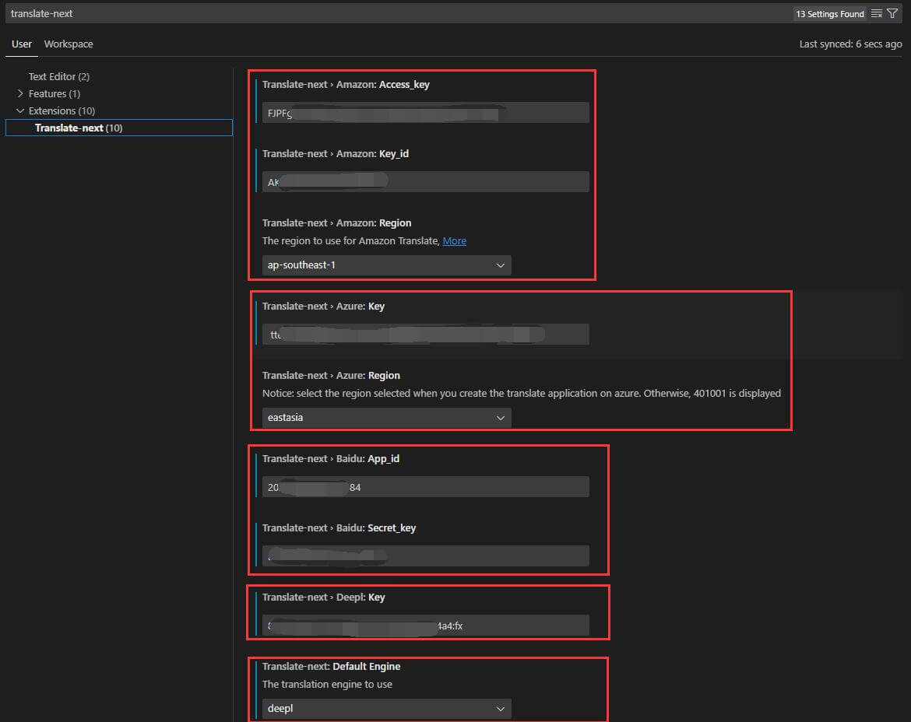
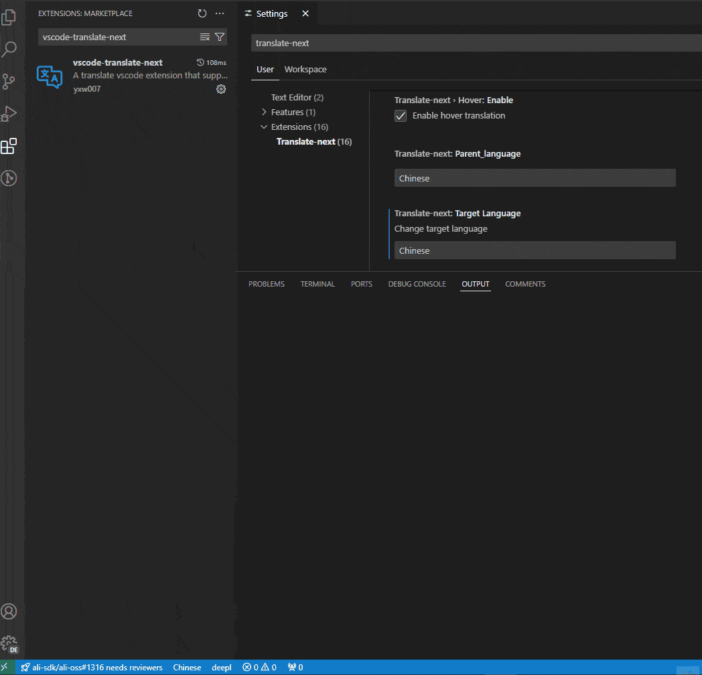
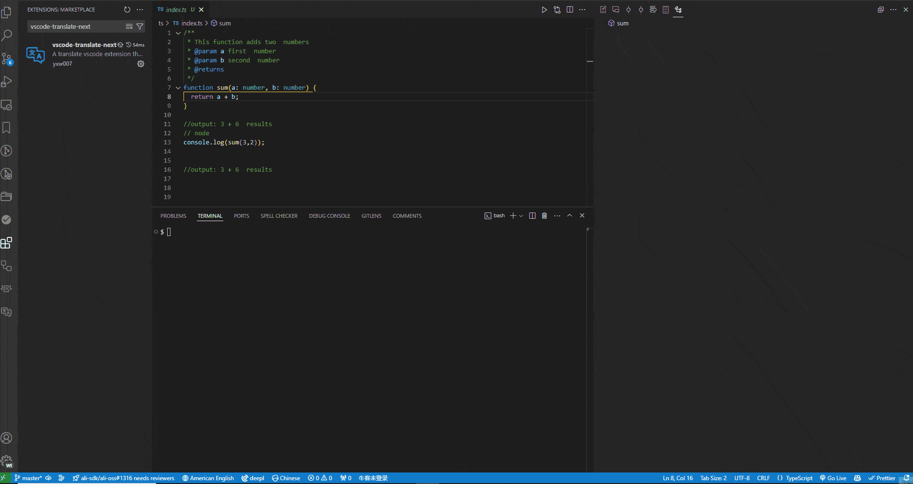
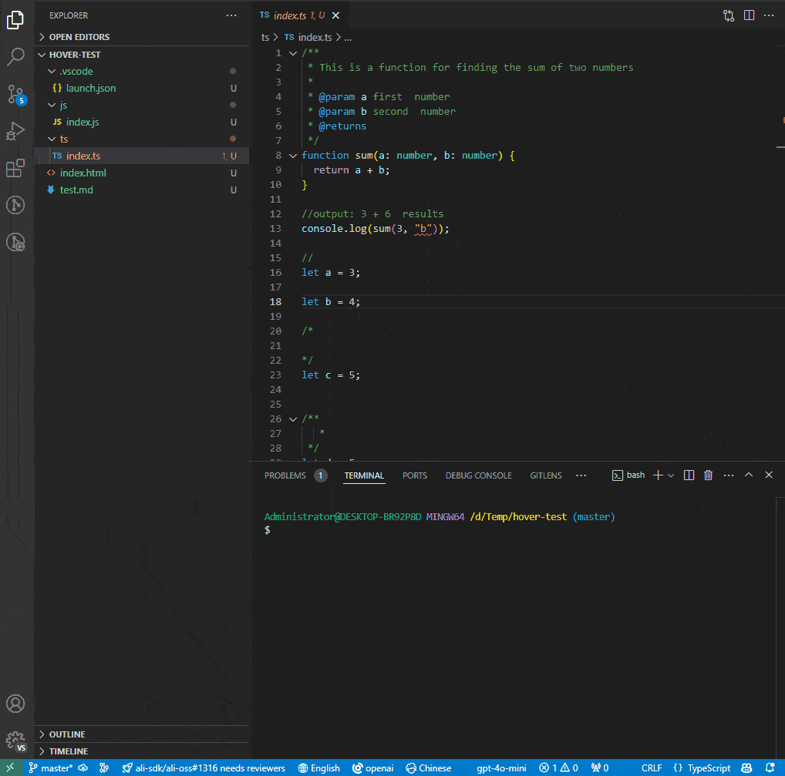
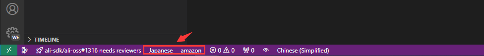
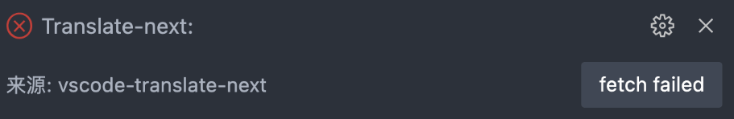

# vscode-translate-next

English | [日語](README_ja.md) | [한국어](README_ko.md) | [简体中文](README_zh-CN.md)

Every programmer must have a vscode translation plugin artifact, it allows you to not be afraid of multi-language, but let you more focused immersive writing code! 🚀

> Note: Underlying translation support provided by [translate](https://github.com/yxw007/translate)

## ✨ Features

- Simple and easy to use
- Support for multiple translation engines: Google, Azure, Amazon, Baidu, Deepl, etc
- Support for translation from one language to any language
- Support hover translate
- Supports translation of selected text in terminals

## 📋 Requirements

- vscode >= 1.91.0

## ⚙️ Config

  

  Tips: In addition to the Google Translate engine, if you set other translation engines as the default translation engine, you need to configure the corresponding translation engine configuration, if other translation engines do not use it, you can do without configuration

## 💻Supported Translation Engines  

| Name             | Support | Description                                                                                                                                               |
| ---------------- | ------- | --------------------------------------------------------------------------------------------------------------------------------------------------------- |
| google           | √       | Commissioned and ready for use                                                                                                                            |
| azure translate  | √       | Commissioned and ready for use                                                                                                                            |
| amazon translate | √       | Commissioned and ready for use                                                                                                                            |
| baidu            | √       | Commissioned and ready for use                                                                                                                            |
| deepl            | √       | Commissioned and ready for use                                                                                                                            |
| openai           | √       | Commissioned and ready for use     (Poor results, cue words are hard to tune in)                                                                          |
| yandex           |         | I have not tuned in as I do not have a bank account supported by the platform (help from those who are in a position to do so is welcome and appreciated) |

## 🛠️ Usage

Download：[vscode-translate-next](https://marketplace.visualstudio.com/items?itemName=yxw007.vscode-translate-next)

- Select translated text
  
- Hover translation
  
- Translation terminal selected text
  
- How to use openai 
  

### 📹 Video Tutorials
- [VSCode必备插件神器，让你更沉浸式写代码](https://www.bilibili.com/video/BV1Y1zMYQEbi/?vd_source=eaea9ad794278c4e15f13efa6d046736)
- [快速上手vscode翻译神器](https://www.bilibili.com/video/BV1eVzZYoEkf/?vd_source=eaea9ad794278c4e15f13efa6d046736)
    
### ⌨️ Shortcut key

| Description                                                         | Shortcut key                                              |
| ------------------------------------------------------------------- | --------------------------------------------------------- |
| The translation is selected from source language to Target language | Shift + Alt + T                                           |
| Switch the target language                                          | Ctrl + Alt + Shit + L (Mac os: Command + Alt + Shift + L) |
| Switch the default translation engine                               | Alt + Shit + E                                            |
| Viewing Plugin Output Logs                                          | Ctrl + Alt + Shit + O (Mac os: Command + Alt + Shift + O) |
| Cleaning the plugin output log                                      | Ctrl + Alt + C   (Mac os: Command + Alt + C)              |
| Translate the selected text in the terminal                         | Alt + `                                                   |
| Clean the terminal translation log                                  | Alt + C                                                   |
| Open the terminal translation panel                                 | Alt + Shift + O                                           |

Tip: If your editor environment has conflicting shortcuts, you can modify and adjust them yourself. If you forget the shortcut keys, you can use the status bar button provided in the bottom status bar to switch between the target language and the default translation engine, as shown in the following figure:

## ❓ FAQ

1. Report: fetch failed error popup
    

  > A: If you have not switched the default engine then you are using Google, and at this time your computer can not access Google will report this error!

2. How do I get keys for other translation engines?

   > A: Check the documentation [https://github.com/yxw007/translate](https://github.com/yxw007/translate) Engine Options Configuration Content

3. Baidu Translation Related, Common Errors

    | error code | connotation       | description                                                                                                               |
    | ---------- | ----------------- | ------------------------------------------------------------------------------------------------------------------------- |
    | 52003      | unauthorized user | Please check if the appid is correct or if the service is enabled!                                                        |
    | 54003      | restricted access | The opened service may be a generic text translation service, which needs to be switched to a domain translation service. |
    
  > For more error codes, see [Error Code List](https://api.fanyi.baidu.com/doc/22).
   

## 📢 More

- To configure other translation engines, you can read the documentation [translate README](https://github.com/yxw007/translate/blob/master/README_zh-CN.md)
- If you encounter problems and don't know how to solve them, you can leave me a message, add my wechat, or submit the Issue.
- This plugin if particularly helpful and greatly improves your efficiency. You can：
    - Follow me + one-click trifecta of my videos (bilibili: [向往自由的码](https://space.bilibili.com/3546754775517426?spm_id_from=333.788.0.0))
    - Points on github for helping my project star ⭐
    - Have better suggestions and ideas for product enhancements, private message me!
    - Become my sponsor： https://github.com/sponsors/yxw007
    - Reward me and buy me a cup of coffee ☕
        

Thank you to everyone who has supported and helped me, your support is my greatest motivation!❤️

## 📄 License

vscode-translate-next is released under the MIT license. for more information, see the [LICENSE](./LICENSE) file.
