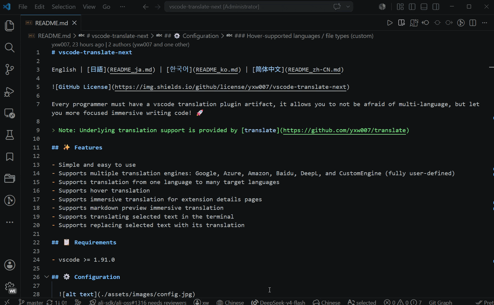
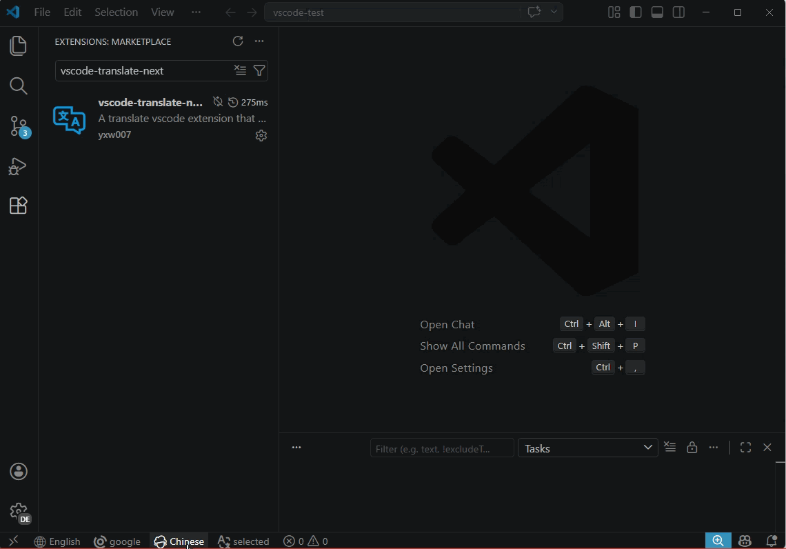

# vscode-translate-next

English | [日語](README_ja.md) | [한국어](README_ko.md) | [简体中文](README_zh-CN.md)


Every programmer must have a vscode translation plugin artifact, it allows you to not be afraid of multi-language, but let you more focused immersive writing code! 🚀

> Note: Underlying translation support is provided by [translate](https://github.com/yxw007/translate)

## ✨ Features

- Simple and easy to use
- Supports multiple translation engines: Google, Azure, Amazon, Baidu, DeepL, and CustomEngine (fully user-defined)
- Supports translation from one language to many target languages
- Supports hover translation
- Supports immersive translation for extension details pages
- Supports markdown preview immersive translation
- Supports translating selected text in the terminal
- Supports replacing selected text with its translation

## 📋 Requirements

- vscode >= 1.91.0

## ⚙️ Configuration

  

  Tip: Google Translate works without extra setup. If you set another engine as the default translation engine, configure that engine first. Engines you do not use do not need to be configured.

### Hover-supported languages / file types (custom)

- `Translate-next.hover.extensions`
  - Default: Built-in list of common programming language file extensions (comma-separated). Default value: `js,jsx,ts,tsx,java,py,c,h,cpp,cc,cxx,hpp,hh,hxx,rs,go,cs,php,rb,swift,kt,kts,scala,dart,lua`.
  - Usage: Enter a comma-separated allowlist of extensions. With or without dots both work, for example: `ts,js,py` or `.ts,.js,.py`.
  - Special: Set it to `*` to enable hover translation for all files. This is not recommended because it may cause unnecessary token usage.
  - Note: If the default list does not include an extension you need, just append it.

## 💻 Supported Translation Engines

| Name             | Supported | Description                                                                                                                                  |
| ---------------- | --------- | -------------------------------------------------------------------------------------------------------------------------------------------- |
| google           | ✔         | Production-ready and available                                                                                                               |
| azure translate  | ✔         | Production-ready and available                                                                                                               |
| amazon translate | ✔         | Production-ready and available                                                                                                               |
| baidu            | ✔         | Production-ready and available                                                                                                               |
| deepl            | ✔         | Production-ready and available                                                                                                               |
| openai           | ✔         | Production-ready and available (results are not ideal and prompt tuning is difficult)                                                        |
| tencent          | ✔         | Production-ready and available                                                                                                               |
| yandex           |           | Not fully configured because I do not have a bank account supported by the platform. Contributions are welcome if you can help make it work. |
| custom Engine    | ✔         | Production-ready and available                                                                                                               |

## 🛠️ Usage

1. Download: [vscode-translate-next](https://marketplace.visualstudio.com/items?itemName=yxw007.vscode-translate-next)
2. Register an account: [https://translate.yanxuewen.cn](https://translate.yanxuewen.cn)
3. Sign in
   

### ✨ Feature Preview
- Hover translation
  
- Translate selected terminal text
  
  (Tip: If the shortcut does not work, click the terminal text translation button in the bottom bar.)
  
- Immersive translation for extension details
  
- Markdown preview immersive translation
  
- Translate selected text
  
- Add a custom translation engine
  
- How to use OpenAI
  

### 📹 Video Tutorials

- [A must-have VS Code extension that helps you code more immersively](https://www.bilibili.com/video/BV1Y1zMYQEbi/?vd_source=eaea9ad794278c4e15f13efa6d046736)
- [Quick start guide for the VS Code translation extension](https://www.bilibili.com/video/BV1eVzZYoEkf/?vd_source=eaea9ad794278c4e15f13efa6d046736)

### ⌨️ Shortcuts

| Description                            | Shortcut                                                   |
| -------------------------------------- | ---------------------------------------------------------- |
| Replace selected text with translation | Shift + Alt + T                                            |
| Switch target language                 | Ctrl + Alt + Shift + L (Mac os: Command + Alt + Shift + L) |
| Switch default translation engine      | Alt + Shift + E                                            |
| View extension output logs             | Ctrl + Alt + Shift + O (Mac os: Command + Alt + Shift + O) |
| Clear extension output logs            | Ctrl + Alt + C (Mac os: Command + Alt + C)                 |
| Translate selected text in terminal    | Ctrl + Alt + ` (Mac os: Command + Alt + `)                 |
| Clear terminal translation logs        | Alt + C                                                    |
| Open terminal translation panel        | Alt + Shift + O                                            |
| Hover translation: enable / disable    | Ctrl + Alt + E                                             |

Tip: If these shortcuts conflict with your environment, adjust them in VS Code. If you forget them, you can also use the status bar buttons at the bottom to switch the target language and the default translation engine, as shown below:


### Custom Engine Configuration

- `Translate-next.customEngines`
  - Purpose: Configure one or more custom translation engines in settings.
  - Language codes: ISO 639 values such as `en`, `ja`, and `zh` can be found in [Wikipedia: List of ISO 639 language codes](https://en.wikipedia.org/wiki/List_of_ISO_639_language_codes).
  - Note: If you need values such as `zh-CN`, append a region suffix to the base language code.

Configuration steps:

1. Open VS Code Settings and search for `Translate-next.customEngines`.
2. Add an object and fill in `name`, `apiUrl`, `method`, and `toLanguages`.
3. If the API requires a request body, configure `body`; if it requires query parameters, configure `query`; if it requires headers, configure `headers`.
4. You can use `{{from}}`, `{{to}}`, and `{{text}}` placeholders in `body`, `query`, and `headers`.
5. If the response stores the translated text in a nested JSON field, set `responsePath`, for example `response`, `data.translation`, or `choices[0].message.content`.
6. After saving the configuration, switch `defaultEngine` to the custom engine name you configured.

Common fields:

- `name`: Custom engine name. Must be unique.
- `apiUrl`: API endpoint.
- `method`: `GET` or `POST`.
- `headers`: Request headers.
- `query`: URL query parameters.
- `body`: Request body.
- `responsePath`: Path used to read the translated text from the response JSON. Array syntax such as `choices[0].message.content` is supported.
- `fromLanguages`: Source language mapping where the key is the language name and the value is the language code.
- `toLanguages`: Target language mapping where the key is the language name and the value is the language code.
- `batchStrategy`: Multi-segment request mode. Supports `none`, `join`, and `array`.
- `joinDelimiter`: Delimiter used when `batchStrategy=join`.
- `timeout`: Request timeout in milliseconds.

Example:

```json
"Translate-next.customEngines": [
  {
    "enabled": true,
    "name": "my-ollama",
    "apiUrl": "http://localhost:11434/api/generate",
    "method": "POST",
    "headers": {
      "Content-Type": "application/json"
    },
    "body": {
      "model": "translategemma:4b",
      "prompt": "Translate {{text}} from {{from}} to {{to}}",
      "stream": false
    },
    "responsePath": "response",
    "fromLanguages": {
      "Chinese": "zh",
      "English": "en",
      "Japanese": "ja",
      "Korean": "ko"
    },
    "toLanguages": {
      "Chinese": "zh",
      "English": "en",
      "Japanese": "ja",
      "Korean": "ko"
    },
    "timeout": 30000
  }
]
```

Response example:

```json
{
  "response": "Hello, world!"
}
```

For this kind of API, set `responsePath: "response"`.

For a Chat Completions style API, you can also configure it like this:

```json
{
  "name": "siliconflow-chat",
  "apiUrl": "https://api.siliconflow.cn/v1/chat/completions",
  "method": "POST",
  "headers": {
    "Authorization": "Bearer sk-xxxx",
    "Content-Type": "application/json"
  },
  "body": {
    "model": "Qwen/Qwen2.5-7B-Instruct",
    "messages": [
      {
        "role": "user",
        "content": "Please translate the following text into English: {{text}}"
      }
    ]
  },
  "responsePath": "choices[0].message.content",
  "toLanguages": {
    "English": "en"
  }
}
```

## ❓ FAQ

1. Error popup: `fetch failed`
   

   > Answer: If you have not changed the default engine, you are using Google. If your computer cannot access Google, this error will appear.

2. How do I get keys for other translation engines?

   > Answer: See the engine configuration section in the [translate documentation](https://github.com/yxw007/translate).

3. Common Baidu Translate errors

   | Error code | Meaning           | Solution                                                                     |
   | ---------- | ----------------- | ---------------------------------------------------------------------------- |
   | 52003      | Unauthorized user | Check whether the `appid` is correct and whether the service is enabled.     |
   | 54003      | Access restricted | You may have enabled general text translation instead of domain translation. |

   > For more error codes, see the [error code list](https://api.fanyi.baidu.com/doc/22).

4. What should I do if shortcuts do not work?

   - Possible cause 1: They conflict with other VS Code shortcuts. Change the conflicting shortcut.
   - Possible cause 2: They conflict with shortcuts from another application. Close external apps one by one, find the conflict, then rebind the shortcut.
   - Hidden features:
     - In the editor view, you can right-click to replace the selected text with its translation.
       
     - For terminal selected-text translation, you can enable it in settings and show it in the bottom bar.
       

5. How can I avoid consuming too many translated characters?

   - Increase the cache duration.
     
   - Only enable the translation features you actually need.
     
   - Avoid selecting a large block of text and then hovering over it. If hover translation is enabled, that can quickly consume a large number of characters.

## 💖 Support Me

If this tool helps you save time and improve your workflow, you can support continued development and maintenance in the following ways:

- Become a sponsor on GitHub Sponsors: https://github.com/sponsors/yxw007

- Buy me a coffee ☕. Every bit of support helps fund ongoing improvements and new features.

  

- Follow me and support my videos on Bilibili: [向往自由的码](https://space.bilibili.com/3546754775517426?spm_id_from=333.788.0.0)
- Give the project a Star on GitHub and recommend the extension to other developers.

I appreciate every bit of support and will prioritize it toward new features and testing. If you have feature requests or suggestions, feel free to open an issue or contact me directly.

## 📢 More

- For configuring other translation engines, see the [translate README](https://github.com/yxw007/translate/blob/master/README_zh-CN.md)
- If you run into problems and are not sure how to solve them, you can leave a message, add me on WeChat (`aa4790139`), or open an issue

## 📄 License

vscode-translate-next is released under the MIT License. See [LICENSE](./LICENSE) for details.
