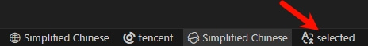
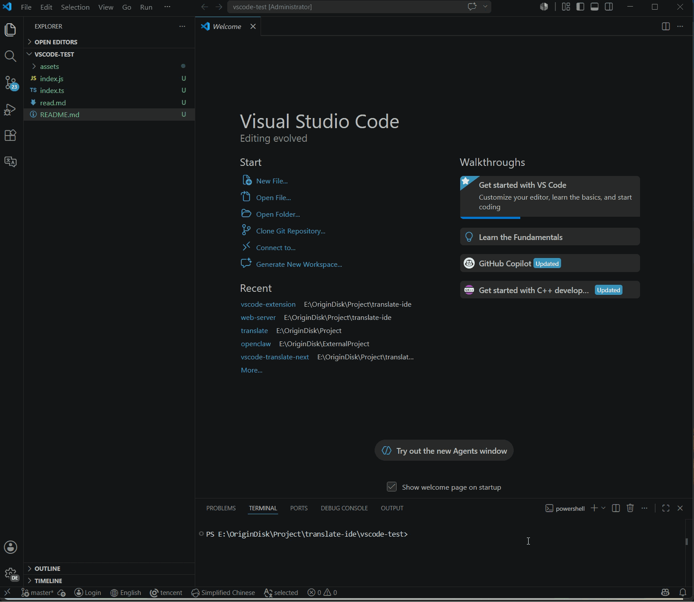
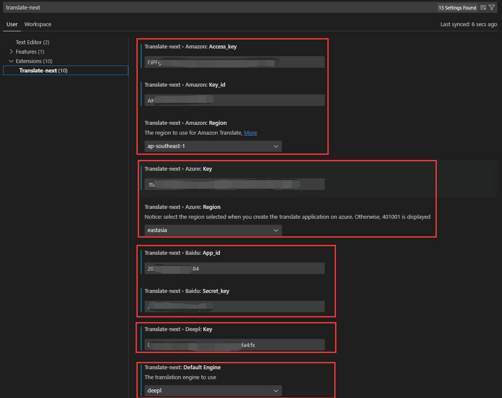
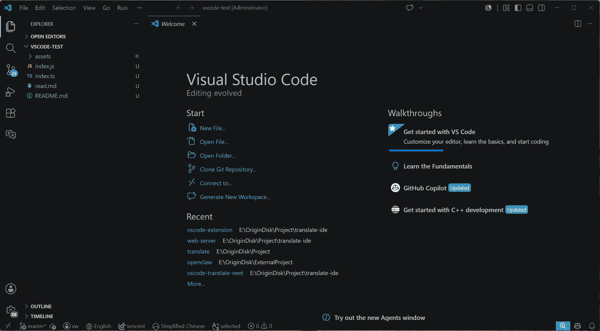
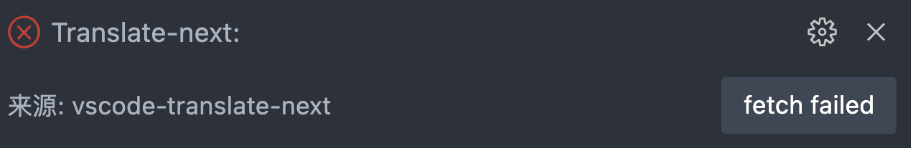
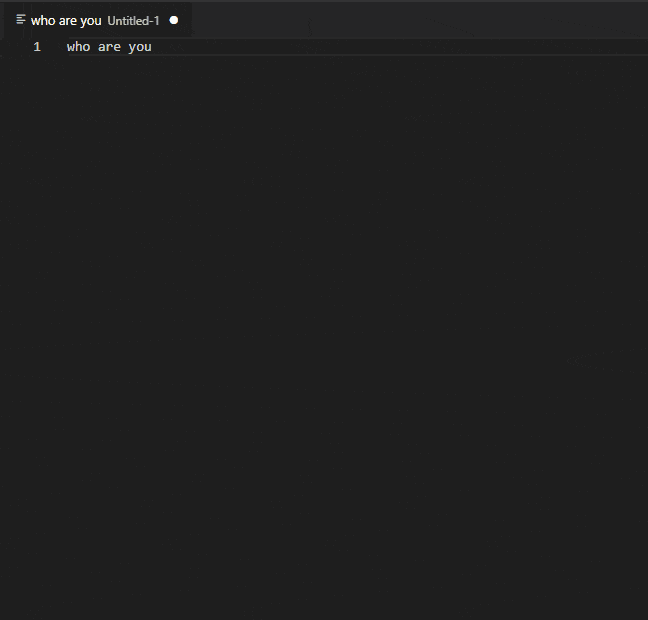
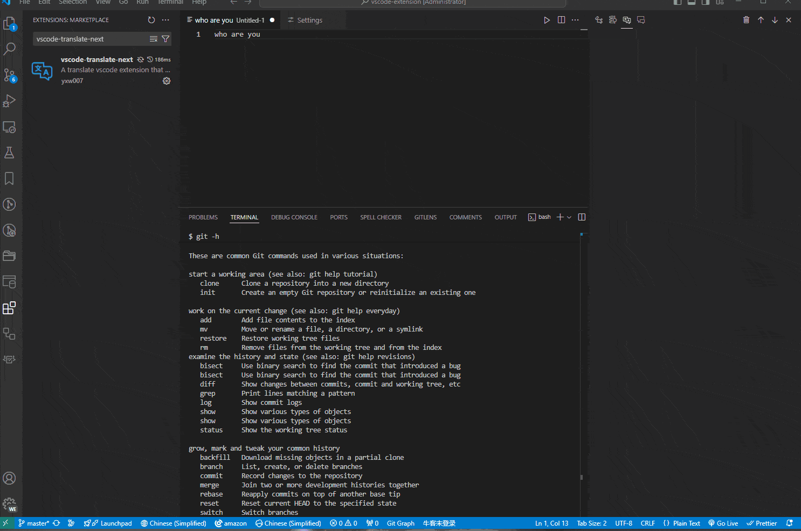
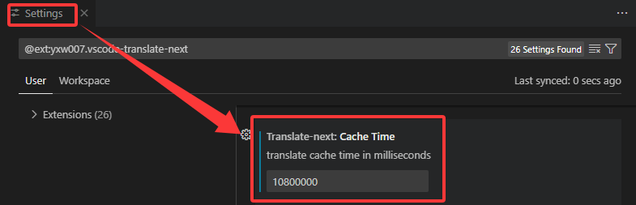
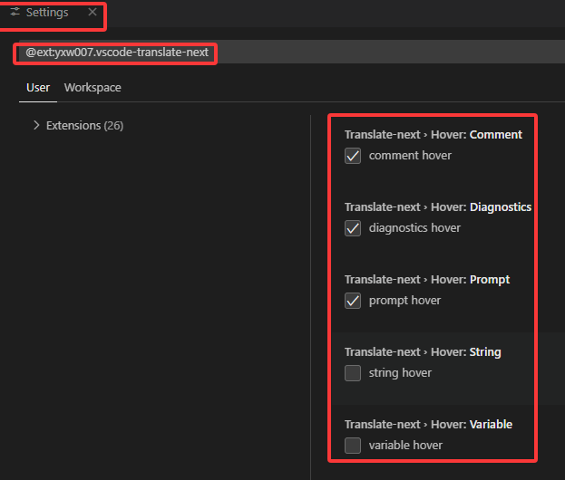

# vscode-translate-next

简体中文 | [日語](README_ja.md) | [English](README_en.md)


每个程序员都必备的一款vscode翻译插件神器，它让你不在惧怕多国语言，而是让你更专注的沉浸式写代码🚀

> 底层由 [translate](https://github.com/yxw007/translate) 提供翻译支持

## ✨ 功能一览

- **Hover 翻译** — 鼠标悬停即译
  
- **Hover 注释替换** — 悬停并替换注释内容
  
- **一键替换所有注释** — 批量翻译项目注释
  
- **翻译终端文本** — 选中即译，快捷键失效时可点击底部栏按钮
  
  (提示：如果快捷键失效，可以点底部栏终端文本翻译按钮)
  
- **插件详情沉浸式翻译** — 阅读外文插件不再困难
  
- **Markdown 预览沉浸式翻译**
  
- **选中文本翻译**
  
- **自定义翻译引擎** — 随心接入各种翻译服务
  

## 📋 环境要求

- VSCode >= 1.91.0

## 💻 支持的翻译引擎

| 引擎             | 费用                | 推荐指数 | 说明                                          |
| ---------------- | ------------------- | -------- | --------------------------------------------- |
| Google           | 完全免费            | ⭐⭐⭐⭐     | 效果好，需能正常访问 Google                   |
| Bing             | 完全免费            | ⭐⭐⭐⭐     | 无网络限制，开箱即用，速度稍慢                |
| Azure Translate  | 每月免费 200 万字符 | ⭐⭐⭐⭐⭐    | 效果好、速度快                                |
| Amazon Translate | 每月免费 200 万字符 | ⭐⭐⭐⭐⭐    | 效果好、速度快                                |
| 百度翻译         | 每月免费 100 万字符 | ⭐⭐⭐⭐⭐    | 效果好、速度快                                |
| DeepL            | 每月免费 50 万字符  | ⭐⭐⭐⭐⭐    | 效果好、速度快，免费额度偏少                  |
| 腾讯翻译         | 每月免费 500 万字符 | ⭐⭐⭐⭐     | 不再推荐，厂商将于 2026/07/31 下线            |
| 自定义引擎       | 完全自定义          | ⭐⭐⭐      | 取决于自定义 API 效果，推荐 DeepSeek-v4-flash |

## 🛠️ 快速上手

1. **安装插件** — 从 [VS Code Marketplace](https://marketplace.visualstudio.com/items?itemName=yxw007.vscode-translate-next) 下载
2. **注册账号** — 访问 [translate.yanxuewen.cn](https://translate.yanxuewen.cn) 注册
3. **登录**
   

### ⚙️ 配置翻译引擎

  

> 提示：google、bing翻译引擎无需配置开箱即用，注意google翻译需可访问google才可正常使用。其他翻译Engine需要进行配置才可使用。

### 🌐 插件本地化显示(中文模式)

1. 安装：[vscode 中文语言包](https://marketplace.visualstudio.com/items?itemName=MS-CEINTL.vscode-language-pack-zh-hans)
  
2. Translate Pro 升级至v1.6.0 以上版本即可
    

### 📝 图文教程
- [配置百度翻译](./course/zh/config-engine/baidu.md)
- [配置腾讯翻译](./course/zh/config-engine/tencent.md)
- [配置自定义翻译引擎](./course/zh/config-engine/custom.md)（内含 DeepSeek、智谱、千问、Xiaomi MiMo 等配置）

> 提示：教程暴露的key仅供演示使用，请勿担心都已失效。

### 🎬 视频教程
- [VSCode 必备插件神器，让你沉浸式写代码](https://www.bilibili.com/video/BV1Y1zMYQEbi/?vd_source=eaea9ad794278c4e15f13efa6d046736)
- [快速上手 VSCode 翻译神器](https://www.bilibili.com/video/BV1eVzZYoEkf/?vd_source=eaea9ad794278c4e15f13efa6d046736)

### 🖱️ Hover 支持的语言/文件类型（自定义）

- `Translate-next.hover.extensions`
  - 默认：已内置一组主流编程语言文件扩展名（英文逗号分隔），默认值：`js,jsx,ts,tsx,java,py,c,h,cpp,cc,cxx,hpp,hh,hxx,rs,go,cs,php,rb,swift,kt,kts,scala,dart,lua`。
  - 用法：用英文逗号分割填写扩展名白名单，带不带点都可以，例如：`ts,js,py` 或 `.ts,.js,.py`。
  - 特殊：配置为 `*` 表示对所有文件启用 hover 翻译（不推荐，可能导致不必要的 token 消耗）。
  - 补充：如果默认列表不包含你需要的扩展名，直接追加即可。
  
### ⌨️ 快捷键

| 功能                 | Windows/Linux            | macOS                   |
| -------------------- | ------------------------ | ----------------------- |
| 替换翻译选中文本     | `Shift + Alt + T`        | `Shift + Alt + T`       |
| 切换目标语言         | `Ctrl + Alt + Shift + L` | `Cmd + Alt + Shift + L` |
| 切换默认翻译引擎     | `Alt + Shift + E`        | `Alt + Shift + E`       |
| 查看插件日志         | `Ctrl + Alt + Shift + O` | `Cmd + Alt + Shift + O` |
| 清理插件日志         | `Ctrl + Alt + C`         | `Cmd + Alt + C`         |
| 翻译终端选中文本     | `Ctrl + Alt + `` `       | `Cmd + Alt + `` `       |
| 清理终端翻译日志     | `Alt + C`                | `Alt + C`               |
| 打开终端翻译面板     | `Alt + Shift + O`        | `Alt + Shift + O`       |
| 启用/禁用 Hover 翻译 | `Ctrl + Alt + E`         | `Ctrl + Alt + E`        |

提示：如果你的编辑器环境，快捷键有冲突，可以自己修改调整。如果忘记快捷键，可以使用底部状态栏提供的状态栏按钮，进行目标语言和默认翻译引擎切换，如下图所示：


## ❓ 常见问题

### 1. 提示 `fetch failed` 错误
 
 

> 答：如果你没有切换过default engine 那么你就是使用的google，而此时你电脑无法访问google就会报此错误

### 2. 我如何获取其他翻译引擎的key呢?

> 答：查看文档[https://github.com/yxw007/translate](https://github.com/yxw007/translate) 引擎选项配置内容

### 3. 按快捷键无效，怎么解决？
 - 可能情况1：vscode中的快捷键冲突，修改冲突的快捷键即可
 - 可能情况2：快捷键与外部软件快捷键冲突，逐步退出外部软件，排查冲突软件，然后修改快捷键
 - 隐藏功能：
   - 编辑视图可以右键替换选中翻译
      
   - 终端选中文本翻译，可以在设置界面中将其打开在底部栏显示
      

### 4. 如何避免消耗过多翻译字符？

- **加大缓存时间**，减少重复翻译
  
- **按需开启翻译功能**，关闭不需要的特性
  
- **避免大量选中文本后悬停** — 选中大段文本再触发 Hover 翻译会快速消耗字符

### 5. 怎么点击底部栏`登录`按钮无反应？
- 可能原因：第1次点击`登录`时，弹出的授权提示框不小心点击不未授权or拒绝导致
- 解决办法：
  - 编辑器内按`F1` -> `Manage Trusted Domains`
  - 在`Trusted Domains`配置文件中添加插件官网地址即可
    ```json
    [
      ...
      "https://translate.yanxuewen.cn",
    ]
    ```
 
## 💖 支持项目

如果这个工具帮你节省了时间、提升了效率，欢迎用以下方式支持我持续维护：

- [成为 GitHub Sponsors](https://github.com/sponsors/yxw007)
- **请我喝杯咖啡 ☕** — 每一份心意都会带来持续的改进

  

- 在 B 站**关注 + 一键三连** ([向往自由的码](https://space.bilibili.com/3546754775517426?spm_id_from=333.788.0.0))
- 在 GitHub **点个 Star ⭐**，推荐给身边的开发者

每一份支持我都非常感谢 ❤️，将优先用于功能迭代。如有建议或需求，欢迎通过 Issue 或私信联系。

## 📢 了解更多

- 更多引擎配置请阅读 [translate 文档](https://github.com/yxw007/translate/blob/master/README_zh-CN.md)
- 遇到问题可留言、提 [Issue](https://github.com/yxw007/vscode-translate-next/issues) 或加微信 `aa4790139`

## 📄 许可证

Translate 是在 MIT 许可证下发布的。详情请见 [LICENSE](./LICENSE) 文件。
