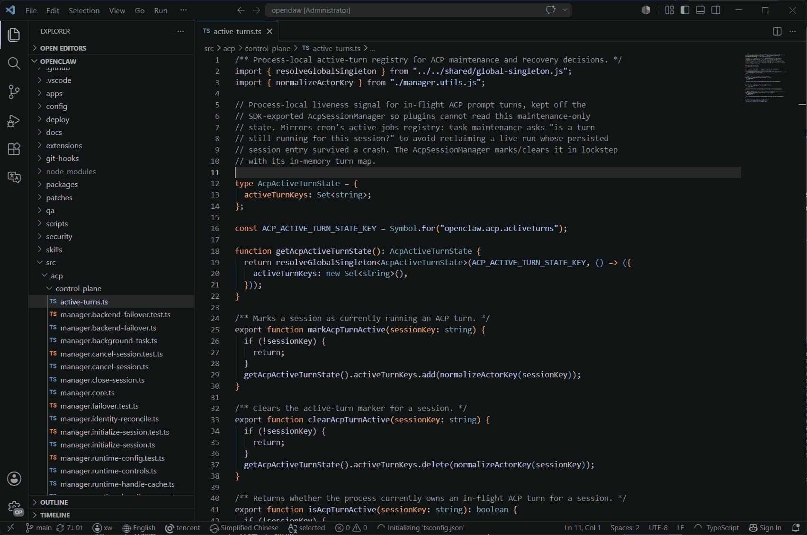
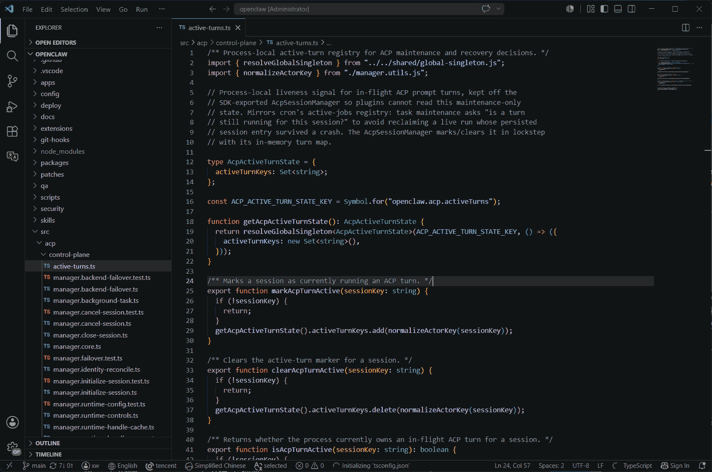

# vscode-translate-next

日語 | [한국어](README_ko.md) | [简体中文](README.md) | [English](README_en.md)

すべてのプログラマーにとって必携の VS Code 翻訳拡張です。多言語環境でも臆することなく、より集中して没入感のあるコーディングを可能にします。🚀

> 説明: 翻訳の基盤機能は [translate](https://github.com/yxw007/translate) によって提供されています

## ✨ プロパティ

- ホーバーの翻訳
  
- hover注釈翻訳置換
  
- すべての注釈をワンタッチで置換
  
- ターミナル選択テキストの翻訳
  
  (ヒント：ショートカットキーが無効な場合は、下部バーのターミナルテキスト翻訳ボタンをクリックします。)
  
- プラグインの詳細没入型翻訳
  
- Markdownプレビューの翻訳
  
- 翻訳テキストを選択
  
- カスタム翻訳エンジンを追加する
  

## 📋 要素は

- vscode >= 1.91.0

## ⚙️ 設定する。

  

  ヒント: Google 翻訳エンジン以外を既定の翻訳エンジンとして使う場合は、先にそのエンジンの設定が必要です。使わない翻訳エンジンは設定不要です。

### 📝 設定チュートリアル
- [百度翻訳エンジンの設定](./course/zh/config-engine/baidu.md)
- [Tencent 翻訳エンジンの設定](./course/zh/config-engine/tencent.md)
- [カスタム翻訳エンジンの設定](./course/zh/config-engine/custom.md)（DeepSeek、Zhipu、Qwen、Xiaomi MiMo 対応）

> ヒント: チュートリアルで公開されているキーはデモ用です。すべて無効になっています。

### 🖱️ Hover 対応言語 / ファイルタイプ（カスタム）

- `Translate-next.hover.extensions`
  - デフォルト: 主要なプログラミング言語の拡張子がカンマ区切りであらかじめ登録されています。既定値: `js,jsx,ts,tsx,java,py,c,h,cpp,cc,cxx,hpp,hh,hxx,rs,go,cs,php,rb,swift,kt,kts,scala,dart,lua`。
  - 使い方: 拡張子の許可リストをカンマ区切りで指定します。ドットの有無はどちらでも構いません。例: `ts,js,py` または `.ts,.js,.py`。
  - 特殊: `*` を設定すると全ファイルで hover 翻訳が有効になります。不要な token 消費につながるため非推奨です。
  - 補足: 既定の一覧に必要な拡張子がなければ、そのまま追加してください。

## 💻 対応翻訳エンジン

| name             | 対応 | 説明         |
| ---------------- | ---- | ------------ |
| google           | ✔    | 本番利用可能 |
| azure translate  | ✔    | 本番利用可能 |
| amazon translate | ✔    | 本番利用可能 |
| baidu            | ✔    | 本番利用可能 |
| deepl            | ✔    | 本番利用可能 |
| tencent          | ✔    | 本番利用可能 |
| custom Engine    | ✔    | 本番利用可能 |

## 🛠️ 使用方法は

1. ダウンロード: [vscode-translate-next](https://marketplace.visualstudio.com/items?itemName=yxw007.vscode-translate-next)
2. 公式サイトでアカウント登録: [https://translate.yanxuewen.cn](https://translate.yanxuewen.cn)
3. ログイン
   

### 🎬 動画チュートリアル

- [VSCode に欠かせない翻訳拡張で、より没入感のあるコーディングを](https://www.bilibili.com/video/BV1Y1zMYQEbi/?vd_source=eaea9ad794278c4e15f13efa6d046736)
- [VSCode 翻訳拡張のクイックスタート](https://www.bilibili.com/video/BV1eVzZYoEkf/?vd_source=eaea9ad794278c4e15f13efa6d046736)

### ⌨️ ショートカット

| 説明                               | ショートカット                                             |
| ---------------------------------- | ---------------------------------------------------------- |
| 選択テキストを翻訳結果で置換       | Shift + Alt + T                                            |
| 翻訳先言語を切り替え               | Ctrl + Alt + Shift + L (Mac os: Command + Alt + Shift + L) |
| 既定の翻訳エンジンを切り替え       | Alt + Shift + E                                            |
| 拡張機能の出力ログを表示           | Ctrl + Alt + Shift + O (Mac os: Command + Alt + Shift + O) |
| 拡張機能の出力ログをクリア         | Ctrl + Alt + C (Mac os: Command + Alt + C)                 |
| ターミナルで選択したテキストを翻訳 | Ctrl + Alt + ` (Mac os: Command + Alt + `)                 |
| ターミナル翻訳ログをクリア         | Alt + C                                                    |
| ターミナル翻訳パネルを開く         | Alt + Shift + O                                            |
| hover 翻訳の有効 / 無効切り替え    | Ctrl + Alt + E                                             |

ヒント: ショートカットが環境と競合する場合は、VS Code 側で変更してください。忘れた場合でも、下部のステータスバーから翻訳先言語と既定の翻訳エンジンを切り替えられます。

## ❓ FAQ

1. `fetch failed` エラーのポップアップが出る
   

   > 答え: 既定の翻訳エンジンを変更していない場合は Google を使っています。その状態で PC から Google にアクセスできないと、このエラーが表示されます。

2. 他の翻訳エンジンのキーはどう取得しますか？

   > 答え: [translate ドキュメント](https://github.com/yxw007/translate) のエンジン設定部分を参照してください。

3. ショートカットが効かない場合は？

   - 可能性 1: VS Code 内のショートカットと競合しているため、競合するものを変更してください。
   - 可能性 2: 外部ソフトのショートカットと競合しているため、外部ソフトを順に終了して原因を切り分けてください。
   - 隠し機能:
     - エディタ画面では右クリックで選択テキストの翻訳置換ができます。
       
     - ターミナル選択テキスト翻訳は設定から有効化し、下部バーに表示できます。
       

4. 翻訳文字数の大量消費を避けるには？

   - キャッシュ時間を長くする
     
   - 必要な翻訳機能だけを有効にする
     
   - 大量のテキストを選択したまま hover しないようにしてください。hover 翻訳が有効だと、文字数消費が急増する可能性があります。

## 💖 サポート

このツールが時間の節約や作業効率の向上に役立っている場合は、継続的な開発と保守のため、次の方法で支援していただけると嬉しいです。

- GitHub Sponsors でスポンサーになる: https://github.com/sponsors/yxw007

- コーヒーをごちそうしてください ☕。いただいた支援は継続的な改善と新機能の追加に活用します。

  

- Bilibili の動画をフォローして応援する: [向往自由的码](https://space.bilibili.com/3546754775517426?spm_id_from=333.788.0.0)
- GitHub で Star を付けたり、周囲の開発者にこの拡張を紹介したりしていただけるのも大きな励みになります。

すべての支援に感謝しています。いただいた応援は機能改善とテストの優先度向上に活かします。要望や提案があれば、Issue やメッセージでご連絡ください。

## 📢 さらに詳しく

- 他の翻訳エンジンの設定については [translate README](https://github.com/yxw007/translate/blob/master/README_zh-CN.md) を参照してください
- 解決方法が分からない問題があれば、メッセージ、WeChat（`aa4790139`）、Issue で連絡できます

## 📄 ライセンス

vscode-translate-next は MIT ライセンスの下で公開されています。詳細は [LICENSE](./LICENSE) を参照してください。
