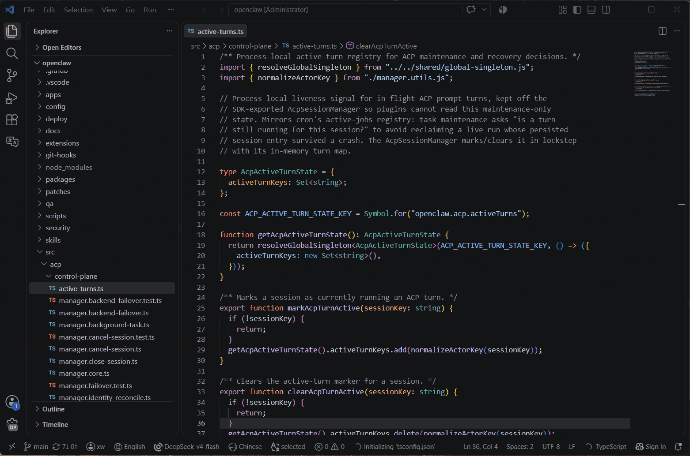

# vscode-translate-next

日語 | [简体中文](README.md) | [English](README_en.md)


言語の壁を越えて、没入感のあるコーディングに集中できる VS Code 翻訳拡張機能 🚀

> 翻訳基盤は [translate](https://github.com/yxw007/translate) が提供

## ✨ 機能一覧

- **Hover 翻訳** — マウスオーバーで即翻訳
  
- **Hover コメント置換** — コメントをホバーして置換
  
- **全コメント一括置換** — プロジェクト内のコメントを一括翻訳
  
- **ターミナル翻訳** — ターミナルで選択したテキストを翻訳
  
  
- **拡張機能の詳細没入型翻訳** — 外国語の拡張も楽々読解
  
- **Markdown プレビュー翻訳** — プレビュー画面で同期翻訳
  
- **選択テキスト翻訳** — テキストを選択してその場で翻訳
  
- **カスタム翻訳エンジン** — 自分好みの翻訳サービスを追加
  

## 📋 環境要件

- VSCode >= 1.91.0

## 💻 対応翻訳エンジン

| エンジン         | 料金            | 評価  | 説明                                  |
| ---------------- | --------------- | ----- | ------------------------------------- |
| Google           | 完全無料        | ⭐⭐⭐⭐  | 高品質、Google へのアクセスが必要     |
| Bing             | 完全無料        | ⭐⭐⭐⭐  | ネット制限なし、すぐ使える、やや低速  |
| Azure Translate  | 月200万文字無料 | ⭐⭐⭐⭐⭐ | 高品質・高速                          |
| Amazon Translate | 月200万文字無料 | ⭐⭐⭐⭐⭐ | 高品質・高速                          |
| 百度翻訳         | 月100万文字無料 | ⭐⭐⭐⭐⭐ | 高品質・高速                          |
| DeepL            | 月50万文字無料  | ⭐⭐⭐⭐⭐ | 高品質・高速、無料枠少なめ            |
| 腾讯翻訳         | 月500万文字無料 | ⭐⭐⭐⭐  | 非推奨、2026/07/31 サービス終了       |
| カスタムエンジン | 完全カスタム    | ⭐⭐⭐   | API 次第、おすすめ: DeepSeek-v4-flash |

## 🛠️ クイックスタート

1. **インストール** — [VS Code Marketplace](https://marketplace.visualstudio.com/items?itemName=yxw007.vscode-translate-next) からダウンロード
2. **アカウント登録** — [translate.yanxuewen.cn](https://translate.yanxuewen.cn) で登録
3. **ログイン**
   

### ⚙️ 翻訳エンジンの設定

  

> Google・Bing は追加設定不要でそのまま使えます。その他のエンジンは設定で API キーを構成してください。

### 🌐 プラグインのローカライズ表示（日本語モード）

1. インストール：[VSCode 日本語言語パック]](https://marketplace.visualstudio.com/items?itemName=MS-CEINTL.vscode-language-pack-ja)
  
2. Translate Pro を v1.9.4 以降のバージョンにアップデートしてください
    

### 📝 設定チュートリアル
- [百度翻訳の設定](./course/zh/config-engine/baidu.md)
- [Tencent 翻訳の設定](./course/zh/config-engine/tencent.md)
- [カスタム翻訳エンジンの設定](./course/zh/config-engine/custom.md)（DeepSeek、Zhipu、Qwen、Xiaomi MiMo 対応）

> チュートリアルに記載のキーはデモ用です。すべて無効です。

### 🎬 動画チュートリアル

- [VSCode に欠かせない翻訳拡張で、より没入感のあるコーディングを](https://www.bilibili.com/video/BV1Y1zMYQEbi/?vd_source=eaea9ad794278c4e15f13efa6d046736)
- [VSCode 翻訳拡張のクイックスタート](https://www.bilibili.com/video/BV1eVzZYoEkf/?vd_source=eaea9ad794278c4e15f13efa6d046736)

### 🖱️ Hover 翻訳範囲（カスタム）

`Translate-next.hover.extensions` で制御：

- **デフォルト**: 主要言語の拡張子が登録済み — `js,jsx,ts,tsx,java,py,c,h,cpp,cc,cxx,hpp,hh,hxx,rs,go,cs,php,rb,swift,kt,kts,scala,dart,lua`
- **使い方**: カンマ区切り、ドット有無どちらでも可（例: `ts,js,py` または `.ts,.js,.py`）
- **特殊値**: `*` を設定すると全ファイルで有効（非推奨、不要な token 消費の可能性）
- **補足**: 必要な拡張子がなければそのまま追加

### ⌨️ ショートカット

| 機能                         | Windows/Linux            | macOS                   |
| ---------------------------- | ------------------------ | ----------------------- |
| 選択テキストを翻訳結果で置換 | `Shift + Alt + T`        | `Shift + Alt + T`       |
| 翻訳先言語を切り替え         | `Ctrl + Alt + Shift + L` | `Cmd + Alt + Shift + L` |
| 既定の翻訳エンジンを切り替え | `Alt + Shift + E`        | `Alt + Shift + E`       |
| 拡張機能ログを表示           | `Ctrl + Alt + Shift + O` | `Cmd + Alt + Shift + O` |
| 拡張機能ログをクリア         | `Ctrl + Alt + C`         | `Cmd + Alt + C`         |
| ターミナル選択テキストを翻訳 | `Ctrl + Alt + `` `       | `Cmd + Alt + `` `       |
| ターミナル翻訳ログをクリア   | `Alt + C`                | `Alt + C`               |
| ターミナル翻訳パネルを開く   | `Alt + Shift + O`        | `Alt + Shift + O`       |
| Hover 翻訳の有効/無効        | `Ctrl + Alt + E`         | `Ctrl + Alt + E`        |

> ショートカットが競合する場合は VS Code 側で変更してください。ステータスバーのボタンからも言語とエンジンを切り替えられます：


## ❓ FAQ

### 1. `fetch failed` エラーが表示される


> **答え**: 既定のエンジンを変更していない場合、Google が使われています。Google にアクセスできない環境だとこのエラーが発生します。別のエンジンに切り替えてください。

### 2. 他の翻訳エンジンのキーはどう取得する？

> **答え**: [translate ドキュメント](https://github.com/yxw007/translate) のエンジン設定を参照してください。

### 3. ショートカットが効かない

- **原因 1**: VS Code 内のショートカットと競合 → 競合するものを変更
- **原因 2**: 外部ソフトと競合 → アプリを順に終了して原因を特定
- **隠し機能**:
  - エディタで右クリック → 選択テキストを翻訳置換
    
  - ターミナル翻訳ボタンを設定から下部バーに表示可能
    

### 4. 翻訳文字数の消費を抑えるには？

- **キャッシュ時間を延長** して重複翻訳を削減
  
- **必要な機能だけ有効** にする
  
- **大量テキストの選択＋Hover を避ける** — 大きな選択範囲で Hover 翻訳を起動すると文字数を急激に消費します

### 5. 画面下部の「ログイン」ボタンをクリックしても反応がないのはなぜですか？
- 考えられる原因：初めて「ログイン」をクリックした際、表示された認証ダイアログで誤って「認証しない」または「拒否」をクリックしてしまったことが原因です
- 解決方法：
  - エディタ内で`F1`を押す → `Manage Trusted Domains`
  - `Trusted Domains`設定ファイルにプラグインの公式サイトのURLを追加すれば解決します
    ```json
    [
      ...
      "https://translate.yanxuewen.cn",
    ]
    ```

## 💖 プロジェクトを支援

このツールが役立っているなら、以下の方法で開発を支援できます：

- [GitHub Sponsors になる](https://github.com/sponsors/yxw007)
- **コーヒーをごちそうする ☕** — 支援は継続的な改善につながります

  

- Bilibili で**フォロー＋高評価** ([向往自由的码](https://space.bilibili.com/3546754775517426?spm_id_from=333.788.0.0))
- GitHub で **Star ⭐** を付け、他の開発者にシェア

すべての支援に感謝します ❤️。機能改善に優先的に活用します。提案や要望は Issue またはメッセージでお知らせください。

## 📢 詳細情報

- 他のエンジン設定は [translate ドキュメント](https://github.com/yxw007/translate/blob/master/README_zh-CN.md) を参照
- 問題があれば、[Issue](https://github.com/yxw007/vscode-translate-next/issues) または WeChat（`aa4790139`）まで

## 📄 ライセンス

本プロジェクトは MIT ライセンスの下で公開されています。詳細は [LICENSE](./LICENSE) を参照してください。
