# vscode-translate-next

简体中文 | [日語](README_ja.md) | [한국어](README_ko.md) | [English](README.md)


每个程序员都必备的一款vscode翻译插件神器，它让你不在惧怕多国语言，而是让你更专注的沉浸式写代码🚀

> 说明：由[translate](https://github.com/yxw007/translate)提供底层翻译支持

## ✨ 特性

- 简单易用
- 支持多翻译引擎：Google,Azure,Amazon,Baidu,deepl，CustomEngine(完全用户自定义)
- 支持从一种语言翻译至各种语言
- 支持悬停翻译
- 替换选中文本翻译
- 支持终端选中文本翻译
- 支持插件详情沉侵式翻译

## 📋 要求

- vscode >= 1.91.0

## ⚙️ 配置

  

  提示：除了google翻译引擎不用配置，如果设置成其他翻译引擎为默认翻译engine，就需要配好对应的翻译引擎配置，如果其他翻译引擎不用，可以不用配置

### Hover 支持的语言/文件类型（自定义）

- `Translate-next.hover.extensions`
  - 默认：已内置一组主流编程语言文件扩展名（英文逗号分隔），默认值：`js,jsx,ts,tsx,java,py,c,h,cpp,cc,cxx,hpp,hh,hxx,rs,go,cs,php,rb,swift,kt,kts,scala,dart,lua`。
  - 用法：用英文逗号分割填写扩展名白名单，带不带点都可以，例如：`ts,js,py` 或 `.ts,.js,.py`。
  - 特殊：配置为 `*` 表示对所有文件启用 hover 翻译（不推荐，可能导致不必要的 token 消耗）。
  - 补充：如果默认列表不包含你需要的扩展名，直接追加即可。

## 💻支持的翻译引擎  

| name             | 支持 | 描述                                                                       |
| ---------------- | ---- | -------------------------------------------------------------------------- |
| google           | ✔    | 已投产，可以正常使用                                                       |
| azure translate  | ✔    | 已投产，可以正常使用                                                       |
| amazon translate | ✔    | 已投产，可以正常使用                                                       |
| baidu            | ✔    | 已投产，可以正常使用                                                       |
| deepl            | ✔    | 已投产，可以正常使用                                                       |
| openai           | ✔    | 已投产，可以正常使用 (效果不佳，提示词很难调好)                            |
| tencent          | ✔    | 已投产，可以正常使用                                                       |
| yandex           |      | 由于我没有平台支持的银行账号，所以未调通（欢迎有条件的朋友帮忙调通，感谢） |
| custom Engine    | ✔    | 已投产，可以正常使用                                                       |

## 🛠️ 使用

1. 下载：[vscode-translate-next](https://marketplace.visualstudio.com/items?itemName=yxw007.vscode-translate-next)
2. 官网注册账号：[https://translate.yanxuewen.cn](https://translate.yanxuewen.cn)
3. 登录
   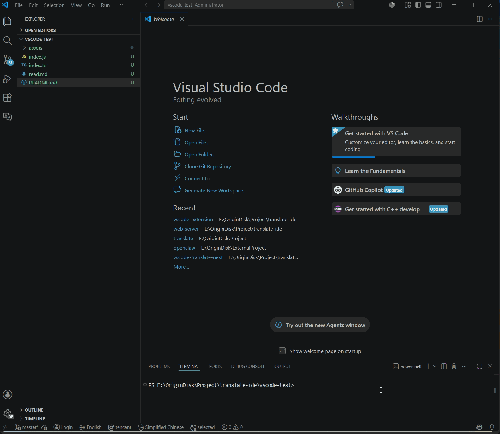

### ✨ 功能效果

- 选中翻译文本
  
- hover 翻译
  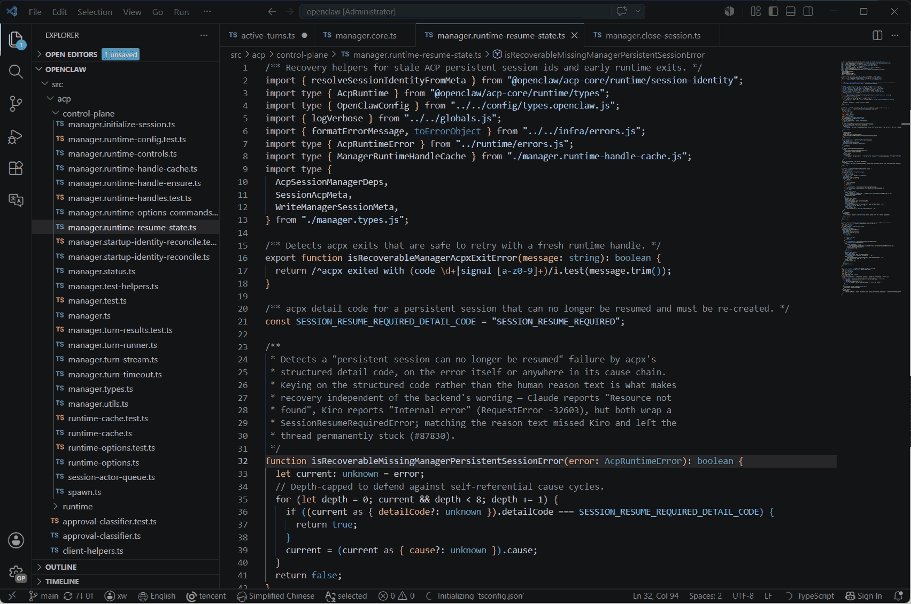
- 翻译终端选中文本
  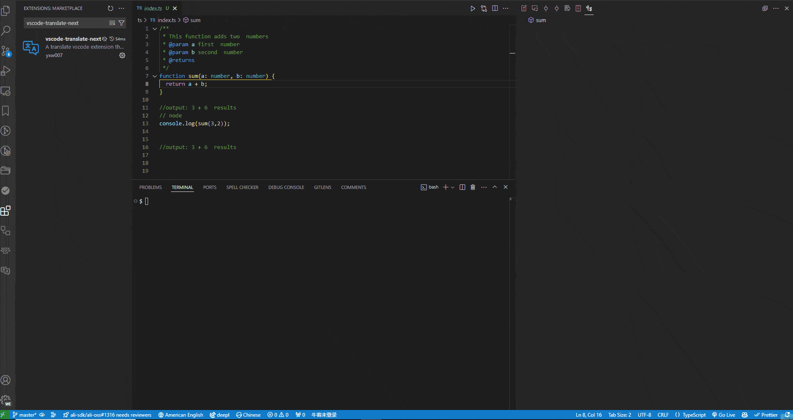
  (提示：如果快捷键失效，可以点底部栏终端文本翻译按钮)
  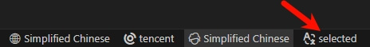
- 如何使用openai 
  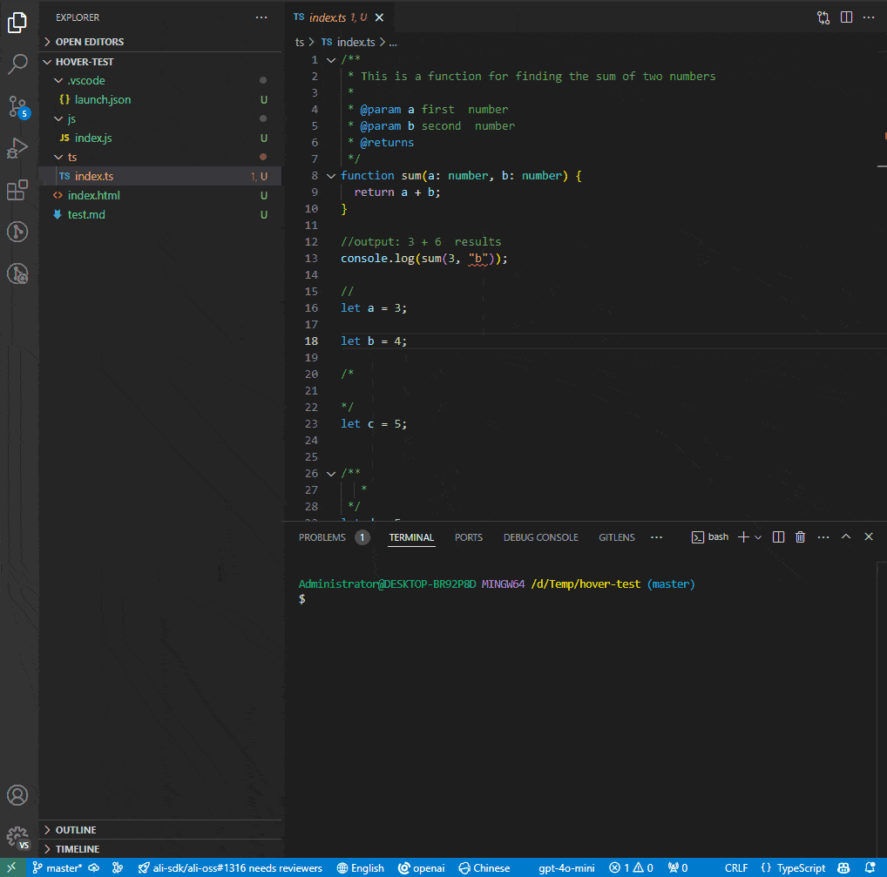
- 插件详情沉浸式翻译
  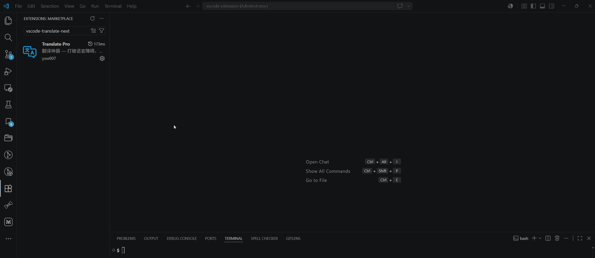

### 📹 视频教程
- [VSCode必备插件神器，让你更沉浸式写代码](https://www.bilibili.com/video/BV1Y1zMYQEbi/?vd_source=eaea9ad794278c4e15f13efa6d046736)
- [快速上手vscode翻译神器](https://www.bilibili.com/video/BV1eVzZYoEkf/?vd_source=eaea9ad794278c4e15f13efa6d046736)

### ⌨️ 快捷键

| 描述                | 快捷键                                                     |
| ------------------- | ---------------------------------------------------------- |
| 替换翻译选中文本    | Shift + Alt + T                                            |
| 切换目标语言        | Ctrl + Alt + Shift + L (Mac os: Command + Alt + Shift + L) |
| 切换默认翻译引擎    | Alt + Shift + E                                            |
| 查看插件输出日志    | Ctrl + Alt + Shift + O (Mac os: Command + Alt + Shift + O) |
| 清理插件输出日志    | Ctrl + Alt + C (Mac os: Command + Alt + C)                 |
| 翻译终端选中文本    | Ctrl + Alt + ` (Mac os: Command + Alt + `)                 |
| 清理终端翻译日志    | Alt + C                                                    |
| 打开终端翻译面板    | Alt + Shift + O                                            |
| 悬停翻译：启用/禁用 | Ctrl + Alt + E                                             |

提示：如果你的编辑器环境，快捷键有冲突，可以自己修改调整。如果忘记快捷键，可以使用底部状态栏提供的状态栏按钮，进行目标语言和默认翻译引擎切换，如下图所示：


### 自定义引擎配置

- `Translate-next.customEngines`
  - 用途：在设置中配置一个或多个自定义翻译引擎。
  - 语言 code 查询：像 `en`、`ja`、`zh` 这类 ISO 639 值，可参考 [Wikipedia: List of ISO 639 language codes](https://en.wikipedia.org/wiki/List_of_ISO_639_language_codes)。
  - 说明：如果你需要 `zh-CN` 这种值，可以在基础语言 code 后面再拼接地区后缀。

配置步骤：

1. 打开 VS Code 设置，搜索 `Translate-next.customEngines`。
2. 新增一个对象，填写 `name`、`apiUrl`、`method`、`toLanguages`。
3. 如果接口需要请求体，就配置 `body`；如果需要 query 参数，就配置 `query`；如果需要请求头，就配置 `headers`。
4. 在 `body`、`query`、`headers` 中可以使用 `{{from}}`、`{{to}}`、`{{text}}` 占位符。
5. 如果返回结果在 JSON 的某个字段里，配置 `responsePath`，例如 `response`、`data.translation` 或 `choices[0].message.content`。
6. 配置完成后，把 `defaultEngine` 切换成你填写的自定义引擎名称即可使用。

常用字段：

- `name`：自定义引擎名称，必须唯一。
- `apiUrl`：接口地址。
- `method`：`GET` 或 `POST`。
- `headers`：请求头。
- `query`：URL 查询参数。
- `body`：请求体。
- `responsePath`：从响应 JSON 中取翻译结果的路径，支持 `choices[0].message.content` 这种数组路径写法。
- `fromLanguages`：源语言映射，key 是语言名，value 是语言 code。
- `toLanguages`：目标语言映射，key 是语言名，value 是语言 code。
- `batchStrategy`：多段文本请求模式，支持 `none`、`join`、`array`。
- `joinDelimiter`：`batchStrategy=join` 时的拼接分隔符。
- `timeout`：请求超时时间，单位毫秒。

示例：

```json
"Translate-next.customEngines": [
  {
    "enabled": true,
    "name": "my-ollama",
    "apiUrl": "http://localhost:11434/api/generate",
    "method": "POST",
    "headers": {
      "Content-Type": "application/json"
    },
    "body": {
      "model": "translategemma:4b",
      "prompt": "将 {{text}} 从 {{from}} 翻译到 {{to}}",
      "stream": false
    },
    "responsePath": "response",
    "fromLanguages": {
      "Chinese": "zh",
      "English": "en",
      "Japanese": "ja",
      "Korean": "ko"
    },
    "toLanguages": {
      "Chinese": "zh",
      "English": "en",
      "Japanese": "ja",
      "Korean": "ko"
    },
    "timeout": 30000
  }
]
```

返回示例：

```json
{
  "response": "你好，世界！"
}
```

上面这种接口配置 `responsePath: "response"` 即可。

如果是 Chat Completions 风格接口，也可以直接这样配：

```json
{
  "name": "siliconflow-chat",
  "apiUrl": "https://api.siliconflow.cn/v1/chat/completions",
  "method": "POST",
  "headers": {
    "Authorization": "Bearer sk-xxxx",
    "Content-Type": "application/json"
  },
  "body": {
    "model": "Qwen/Qwen2.5-7B-Instruct",
    "messages": [
      {
        "role": "user",
        "content": "请将以下文本翻译成英文：{{text}}"
      }
    ]
  },
  "responsePath": "choices[0].message.content",
  "toLanguages": {
    "English": "en"
  }
}
```

## ❓ FAQ

1. 报：fetch failed 错误弹框
    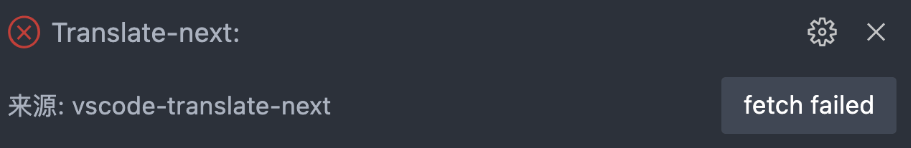

  > 答：如果你没有切换过default engine 那么你就是使用的google，而此时你电脑无法访问google就会报此错误

2. 我如何获取其他翻译引擎的key呢?

   > 答：查看文档[https://github.com/yxw007/translate](https://github.com/yxw007/translate) 引擎选项配置内容

3. 百度翻译相关，常见报错

    | 错误码 | 含义       | 解决方案                                               |
    | ------ | ---------- | ------------------------------------------------------ |
    | 52003  | 未授权用户 | 请检查appid是否正确或者服务是否开通                    |
    | 54003  | 访问受限   | 开通的服务可能是通用文本翻译服务，需要改成领域翻译服务 |
    
  > 更多错误码，请查看 [错误码列表](https://api.fanyi.baidu.com/doc/22)

4. 按快捷键无效，怎么解决？
   - 可能情况1：vscode中的快捷键冲突，修改冲突的快捷键即可
   - 可能情况2：快捷键与外部软件快捷键冲突，逐步退出外部软件，排查冲突软件，然后修改快捷键
   - 隐藏功能：
     - 编辑视图可以右键替换选中翻译
        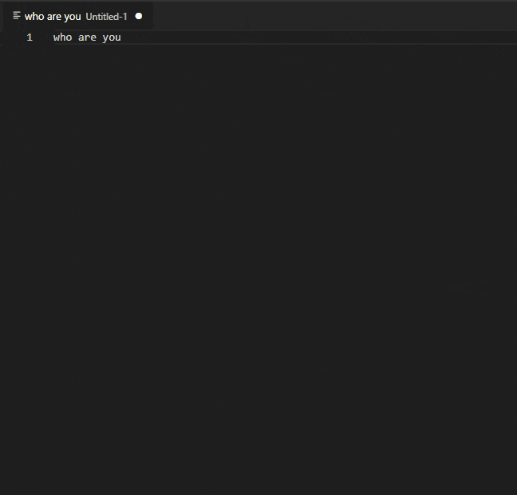
     - 终端选中文本翻译，可以在设置界面中将其打开在底部栏显示
        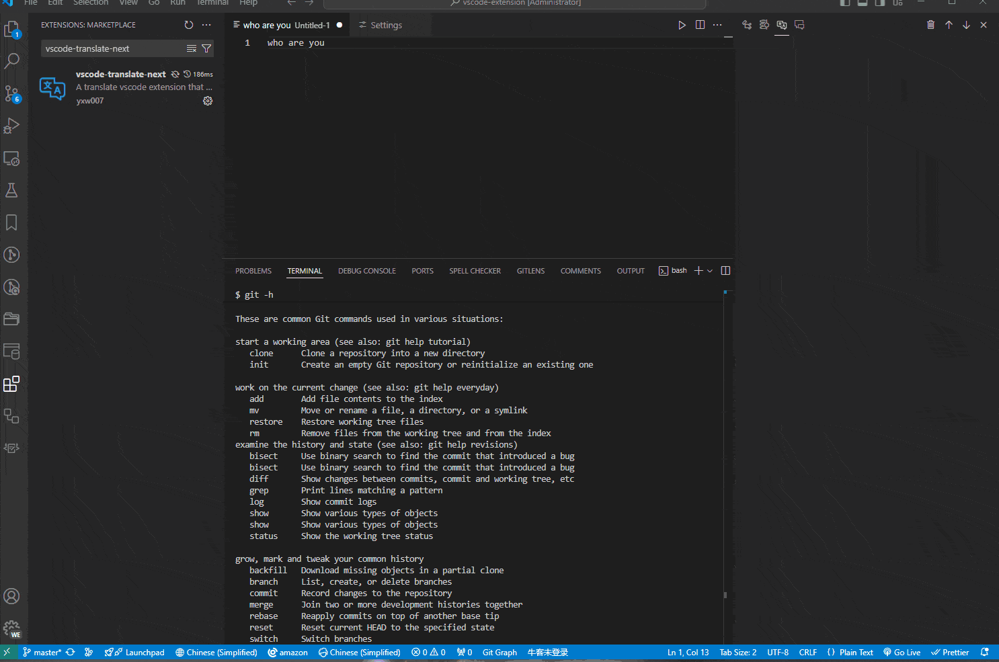

5. 如果避免大量翻译字符消耗?
   - 加大缓存时间
     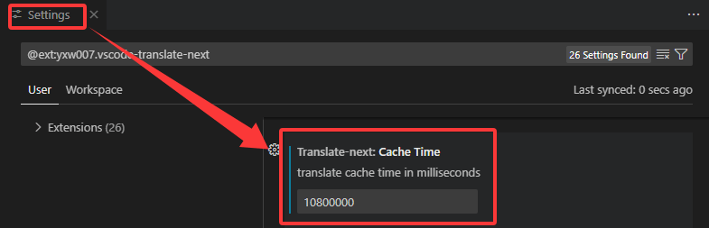
   - 自主控制要开启和关闭的翻译功能
    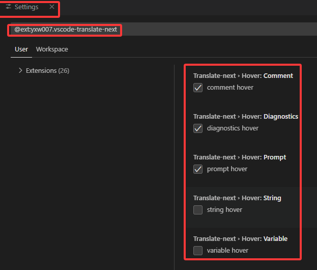
   - 避免选中大量文本，然后hover到选中文本上，此时如果开启了hover翻译，就会快速消耗大量翻译字符，所以应该避免这种操作

## 💖 支持我

如果此工具帮助你节省了时间、提升了工作效率，欢迎你用以下方式来支持我继续开发与维护：

- 成为我的赞助人（GitHub Sponsors）：https://github.com/sponsors/yxw007

- 请我喝杯咖啡☕（小额打赏）——每一份支持都能带来持续改进和更多新特性。

  

- 关注我 + 一键三连我的视频 (bilibili: [向往自由的码](https://space.bilibili.com/3546754775517426?spm_id_from=333.788.0.0))
- 在 GitHub 点个 Star⭐、把插件推荐给身边的开发者，这些都是极大的鼓励。

每一份支持我都非常感谢❤️，会优先用于功能迭代和测试。如果你有特别的建议或希望我做的功能，欢迎通过 Issue 或私信联系。

## 📢 更多

- 配置其他翻译引擎，可以阅读文档[translate README](https://github.com/yxw007/translate/blob/master/README_zh-CN.md)
- 碰到问题不知道怎么解决，可以给我留言、加我微信(aa4790139)、提Issue 都可以


## 📄 许可证

Translate 是在 MIT 许可证下发布的。详情请见 [LICENSE](./LICENSE) 文件。
