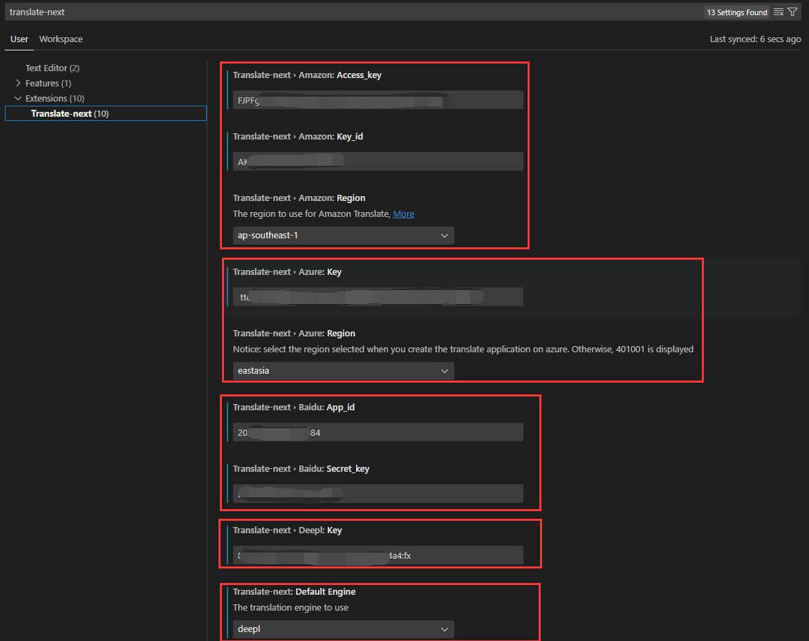
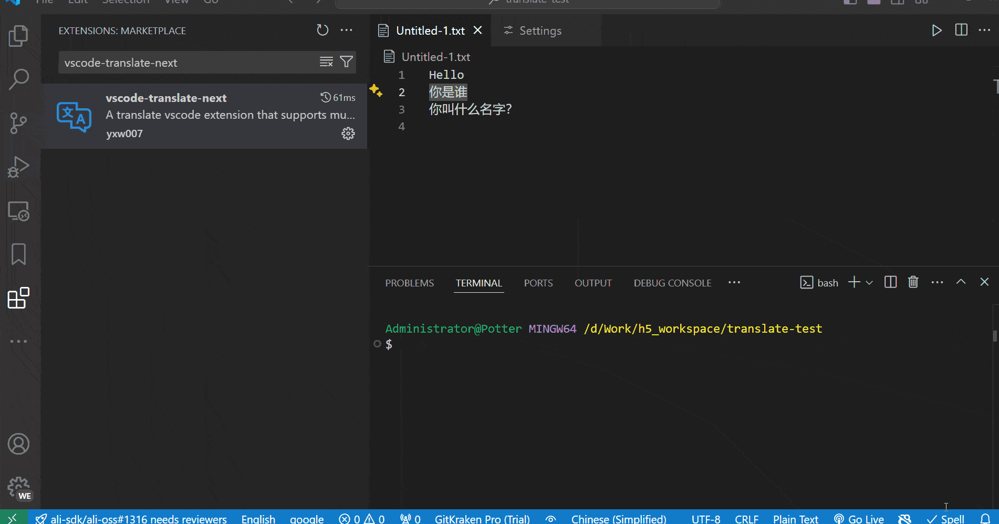

# vscode-translate-next 

简体中文 | [English](./README.md)

快速批量翻译文本，让国际化更加轻松🚀 

> 说明：由[translate](https://github.com/yxw007/translate)提供底层翻译支持

## ✨ 特性

- 简单易用
- 支持多翻译引擎：Google,Azure,Amazon,Baidu等
- 支持从一种语言翻译至各种语言

## 📋 要求

- vscode >= 1.91.0

## ⚙️ 配置
  

  提示：除了google翻译引擎不用配置，如果设置成其他翻译引擎为默认翻译engine，就需要配好对应的翻译引擎配置，如果其他翻译引擎不用，可以不用配置

## 💻支持的翻译引擎  

| name             | 支持 | 描述                                                                       |
| ---------------- | ---- | -------------------------------------------------------------------------- |
| google           | √    | 已投产，可以正常使用                                                       |
| azure translate  | √    | 已投产，可以正常使用                                                       |
| amazon translate | √    | 已投产，可以正常使用                                                       |
| baidu            | √    | 已投产，可以正常使用                                                       |
| deepl            | √    | 已投产，可以正常使用                                                       |
| yandex           |      | 由于我没有平台支持的银行账号，所以未调通（欢迎有条件的朋友帮忙调通，感谢） |

## 🛠️ 使用

下载：[vscode-translate-next](https://marketplace.visualstudio.com/items?itemName=yxw007.vscode-translate-next)

### ⌨️ 快捷键

| 描述             | 快捷键                |
| ---------------- | --------------------- |
| 翻译选中文本     | Shift + Alt + T       |
| 切换目标语言     | Ctrl + Alt + Shit + L |
| 切换默认翻译引擎 | Alt + Shit + E        |

提示：如果你的编辑器环境，快捷键有冲突，可以自己修改调整。如果忘记快捷键，可以使用底部状态栏提供的状态栏按钮，进行目标语言和默认翻译引擎切换，如下图所示：

## 📢 更多

此插件已可以正常使用，欢迎大家体验、如果你有任何问题和建议都可以提Issue给我反馈。
如果你感兴趣，特别欢迎你的加入，让我们一起完善好这个工具。
帮忙点个star⭐，让更多人知道这个工具，感谢大家🙏

## 📄 许可证

Translate 是在 MIT 许可证下发布的。详情请见 [LICENSE](./LICENSE) 文件。
