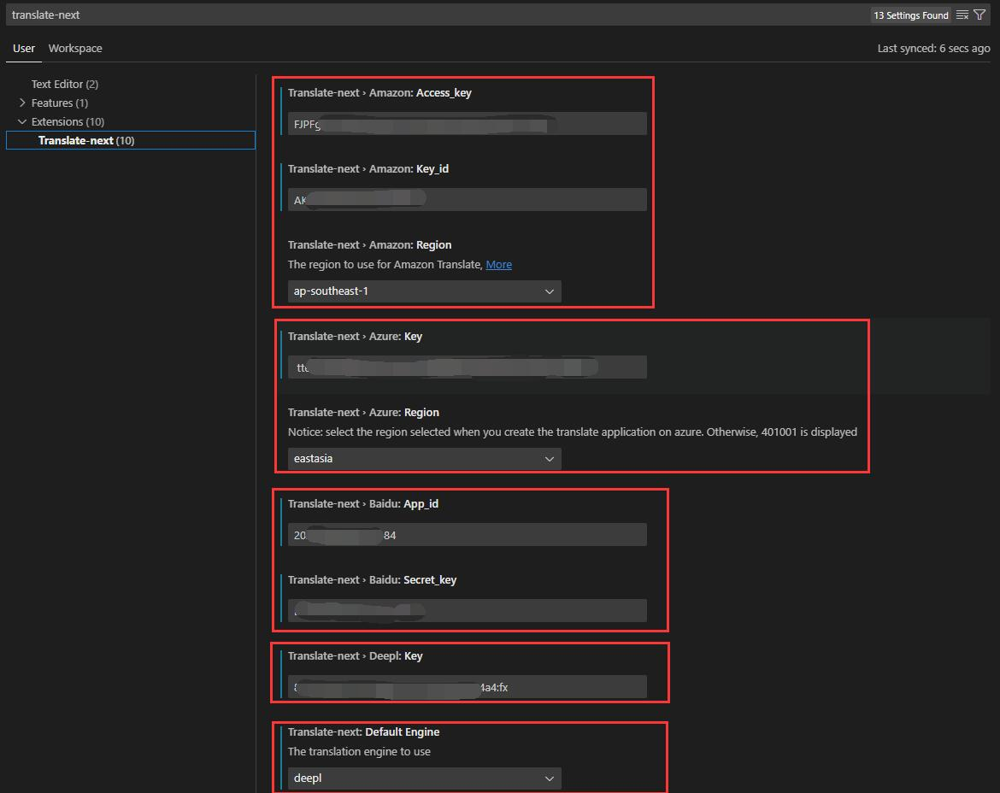
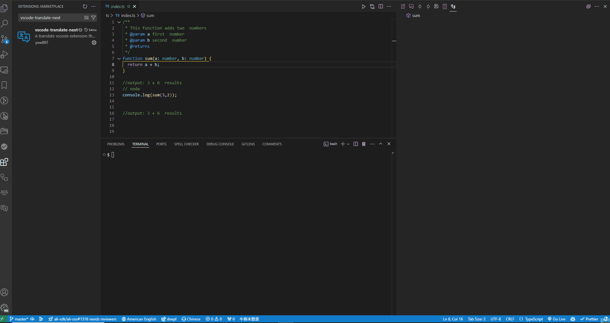
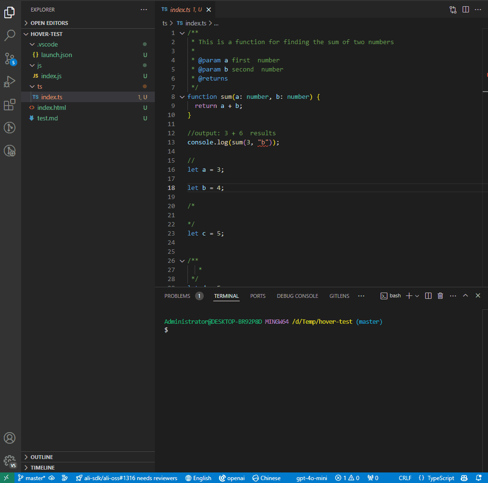

# vscode-translate-next

简体中文 | [日語](README_ja.md) | [한국어](README_ko.md) | [English](README.md)

每个程序员都必备的一款vscode翻译插件神器，它让你不在惧怕多国语言，而是让你更专注的沉浸式写代码🚀

> 说明：由[translate](https://github.com/yxw007/translate)提供底层翻译支持

## 💖 支持我

如果此工具帮助你节省了时间、提升了工作效率，欢迎你用以下方式来支持我继续开发与维护：

- 成为我的赞助人（GitHub Sponsors）：https://github.com/sponsors/yxw007

- 请我喝杯咖啡☕（小额打赏）——每一份支持都能带来持续改进和更多新特性。

  

- 关注我 + 一键三连我的视频 (bilibili: [向往自由的码](https://space.bilibili.com/3546754775517426?spm_id_from=333.788.0.0))
- 在 GitHub 点个 Star⭐、把插件推荐给身边的开发者，这些都是极大的鼓励。

每一份支持我都非常感谢❤️，会优先用于功能迭代和测试。如果你有特别的建议或希望我做的功能，欢迎通过 Issue 或私信联系。

## ✨ 特性

- 简单易用
- 支持多翻译引擎：Google,Azure,Amazon,Baidu,deepl等
- 支持从一种语言翻译至各种语言
- 支持悬停翻译
- 替换选中文本翻译
- 支持终端选中文本翻译

## 📋 要求

- vscode >= 1.91.0

## ⚙️ 配置

  

  提示：除了google翻译引擎不用配置，如果设置成其他翻译引擎为默认翻译engine，就需要配好对应的翻译引擎配置，如果其他翻译引擎不用，可以不用配置

## 💻支持的翻译引擎  

| name             | 支持 | 描述                                                                       |
| ---------------- | ---- | -------------------------------------------------------------------------- |
| google           | ✔    | 已投产，可以正常使用                                                       |
| azure translate  | ✔    | 已投产，可以正常使用                                                       |
| amazon translate | ✔    | 已投产，可以正常使用                                                       |
| baidu            | ✔    | 已投产，可以正常使用                                                       |
| deepl            | ✔    | 已投产，可以正常使用                                                       |
| openai           | ✔    | 已投产，可以正常使用 (效果不佳，提示词很难调好)                            |
| tencent          | ✔    | 已投产，可以正常使用                                                       |
| yandex           |      | 由于我没有平台支持的银行账号，所以未调通（欢迎有条件的朋友帮忙调通，感谢） |

## 🛠️ 使用

下载：[vscode-translate-next](https://marketplace.visualstudio.com/items?itemName=yxw007.vscode-translate-next)

- 选中翻译文本
  
- hover 翻译
  
- 翻译终端选中文本
  
- 如何使用openai 
  

### 📹 视频教程
- [VSCode必备插件神器，让你更沉浸式写代码](https://www.bilibili.com/video/BV1Y1zMYQEbi/?vd_source=eaea9ad794278c4e15f13efa6d046736)
- [快速上手vscode翻译神器](https://www.bilibili.com/video/BV1eVzZYoEkf/?vd_source=eaea9ad794278c4e15f13efa6d046736)

### ⌨️ 快捷键

| 描述             | 快捷键                                                     |
| ---------------- | ---------------------------------------------------------- |
| 替换翻译选中文本 | Shift + Alt + T                                            |
| 切换目标语言     | Ctrl + Alt + Shift + L (Mac os: Command + Alt + Shift + L) |
| 切换默认翻译引擎 | Alt + Shift + E                                            |
| 查看插件输出日志 | Ctrl + Alt + Shift + O (Mac os: Command + Alt + Shift + O) |
| 清理插件输出日志 | Ctrl + Alt + C (Mac os: Command + Alt + C)                 |
| 翻译终端选中文本 | Alt + `                                                    |
| 清理终端翻译日志 | Alt + C                                                    |
| 打开终端翻译面板 | Alt + Shift + O                                            |

提示：如果你的编辑器环境，快捷键有冲突，可以自己修改调整。如果忘记快捷键，可以使用底部状态栏提供的状态栏按钮，进行目标语言和默认翻译引擎切换，如下图所示：

## ❓ FAQ

1. 报：fetch failed 错误弹框
    

  > 答：如果你没有切换过default engine 那么你就是使用的google，而此时你电脑无法访问google就会报此错误

2. 我如何获取其他翻译引擎的key呢?

   > 答：查看文档[https://github.com/yxw007/translate](https://github.com/yxw007/translate) 引擎选项配置内容

3. 百度翻译相关，常见报错

    | 错误码 | 含义       | 解决方案                                               |
    | ------ | ---------- | ------------------------------------------------------ |
    | 52003  | 未授权用户 | 请检查appid是否正确或者服务是否开通                    |
    | 54003  | 访问受限   | 开通的服务可能是通用文本翻译服务，需要改成领域翻译服务 |
    
  > 更多错误码，请查看 [错误码列表](https://api.fanyi.baidu.com/doc/22)

4. 按快捷键无效，怎么解决？
   - 可能情况1：vscode中的快捷键冲突，修改冲突的快捷键即可
   - 可能情况2：快捷键与外部软件快捷键冲突，逐步退出外部软件，排查冲突软件，然后修改快捷键
   - 隐藏功能：
     - 编辑视图可以右键替换选中翻译
        
     - 终端选中文本翻译，可以在设置界面中将其打开在底部栏显示
        

5. 如果避免大量翻译字符消耗?
   - 加大缓存时间
     
   - 自主控制要开启和关闭的翻译功能
    
   - 避免选中大量文本，然后hover到选中文本上，此时如果开启了hover翻译，就会快速消耗大量翻译字符，所以应该避免这种操作

## 📢 更多

- 配置其他翻译引擎，可以阅读文档[translate README](https://github.com/yxw007/translate/blob/master/README_zh-CN.md)
- 碰到问题不知道怎么解决，可以给我留言、加我微信(aa4790139)、提Issue 都可以

## 📄 许可证

Translate 是在 MIT 许可证下发布的。详情请见 [LICENSE](./LICENSE) 文件。
