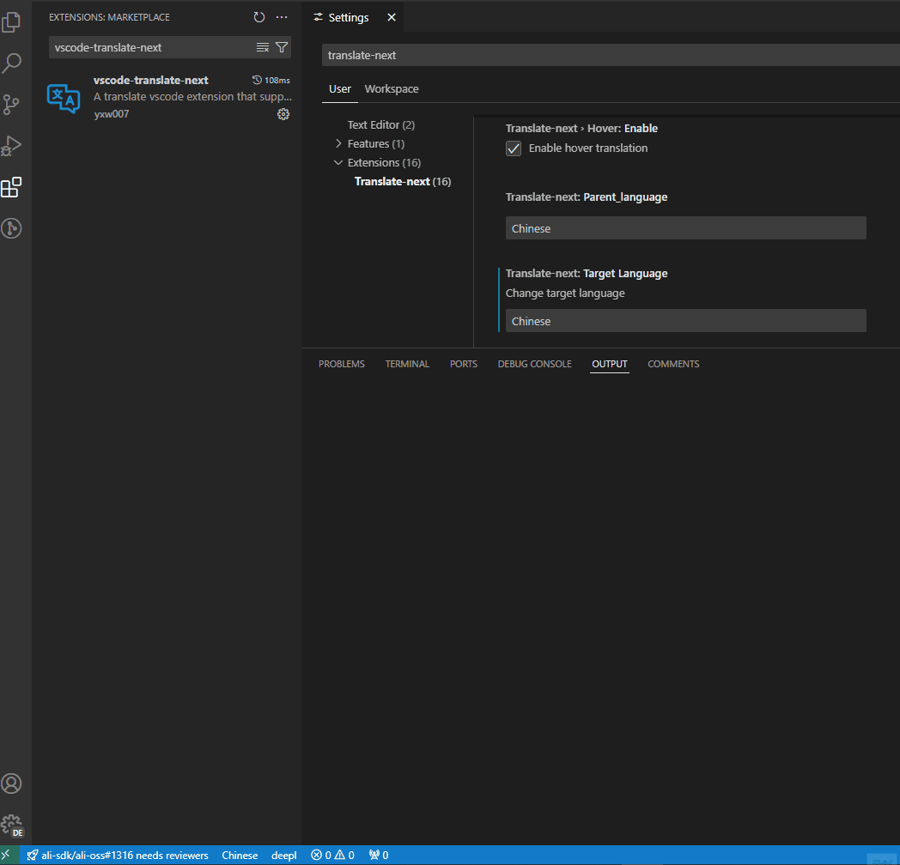
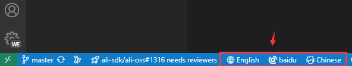

# translate-ide

简体中文 | [English](./README.md)

每个程序员都必备的一款vscode翻译插件神器，它让你不在惧怕多国语言，而是让你更专注的沉浸式写代码🚀

> 说明：由[translate](https://github.com/yxw007/translate)提供底层翻译支持

## ✨ 特性

- 简单易用
- 支持多翻译引擎：Google,Azure,Amazon,Baidu,deepl等
- 支持从一种语言翻译至各种语言
- 支持悬停翻译
- 支持终端选中文本翻译

## 📋 要求

- vscode >= 1.91.0

## ⚙️ 配置

  

  提示：除了google翻译引擎不用配置，如果设置成其他翻译引擎为默认翻译engine，就需要配好对应的翻译引擎配置，如果其他翻译引擎不用，可以不用配置

## 💻支持的翻译引擎  

| name             | 支持 | 描述                                                                       |
| ---------------- | ---- | -------------------------------------------------------------------------- |
| google           | √    | 已投产，可以正常使用                                                       |
| azure translate  | √    | 已投产，可以正常使用                                                       |
| amazon translate | √    | 已投产，可以正常使用                                                       |
| baidu            | √    | 已投产，可以正常使用                                                       |
| deepl            | √    | 已投产，可以正常使用                                                       |
| yandex           |      | 由于我没有平台支持的银行账号，所以未调通（欢迎有条件的朋友帮忙调通，感谢） |

## 🛠️ 使用

下载：[translate-ide](https://marketplace.visualstudio.com/items?itemName=yxw007.translate-ide)

- 选中翻译文本
  
- hover 翻译
  
- 翻译终端选中文本
  
    

### ⌨️ 快捷键

| 描述             | 快捷键                |
| ---------------- | --------------------- |
| 翻译选中文本     | Shift + Alt + T       |
| 切换目标语言     | Ctrl + Alt + Shit + L |
| 切换默认翻译引擎 | Alt + Shit + E        |
| 查看插件输出日志 | Alt + Shit + O        |
| 清理插件输出日志 | Alt + C               |
| 翻译终端选中文本 | Alt + `               |

提示：如果你的编辑器环境，快捷键有冲突，可以自己修改调整。如果忘记快捷键，可以使用底部状态栏提供的状态栏按钮，进行目标语言和默认翻译引擎切换，如下图所示：

## ❓ FAQ

1. 报：fetch failed 错误弹框
    

  > 答：如果你没有切换过default engine 那么你就是使用的google，而此时你电脑无法访问google就会报此错误

2. 我如何获取其他翻译引擎的key呢?

   > 答：查看文档[https://github.com/yxw007/translate](https://github.com/yxw007/translate) 引擎选项配置内容

3. 百度翻译相关，常见报错

    | 错误码 | 含义       | 解决方案                                               |
    | ------ | ---------- | ------------------------------------------------------ |
    | 52003  | 未授权用户 | 请检查appid是否正确或者服务是否开通                    |
    | 54003  | 访问受限   | 开通的服务可能是通用文本翻译服务，需要改成领域翻译服务 |
    
  > 更多错误码，请查看 [错误码列表](https://api.fanyi.baidu.com/doc/22)

## 📢 更多

- 配置其他翻译引擎，可以阅读文档[translate README](https://github.com/yxw007/translate/blob/master/README_zh-CN.md)
- 碰到问题不知道怎么解决，可以给我留言、加我微信、提Issue 都可以
- 此插件如果对你帮助特别大，大大提升了你的效率。你可以：
    - 关注我 + 一键三连我的视频 (bilibili: [向往自由的码](https://space.bilibili.com/3546754775517426?spm_id_from=333.788.0.0))
    - github上帮我项目的点star ⭐
    - 对产品提升有更好的建议和想法，私信告诉我
    - 成为我的赞助人： https://github.com/sponsors/yxw007
    - 打赏我，请我喝杯咖啡☕
        

感谢每一位支持和帮助过我的人，您的支持是我最大的动力！❤️

## 📄 许可证

Translate 是在 MIT 许可证下发布的。详情请见 [LICENSE](./LICENSE) 文件。
