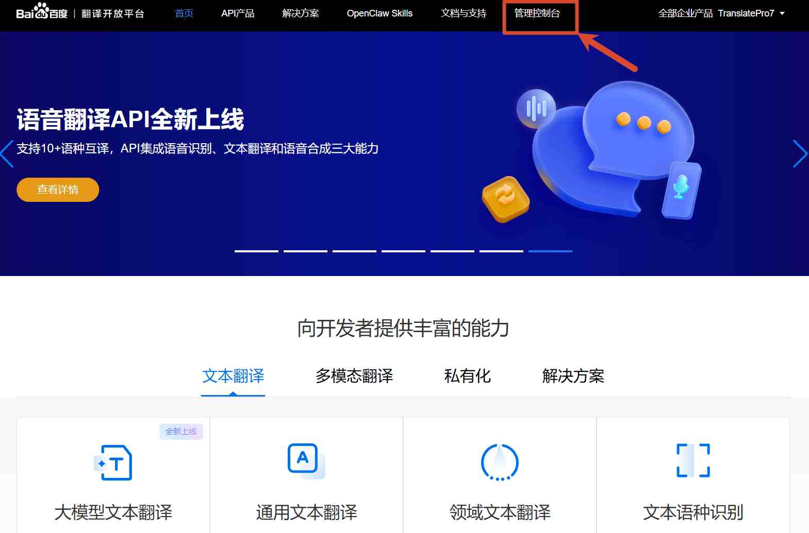
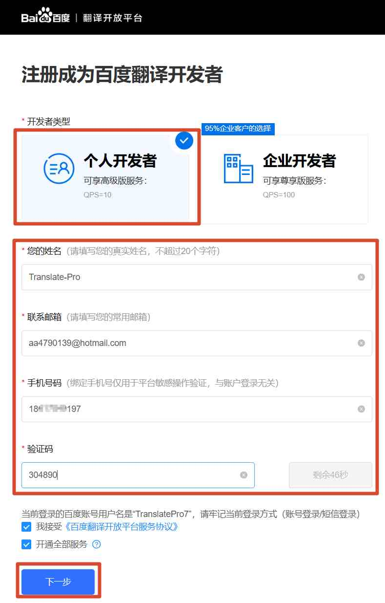
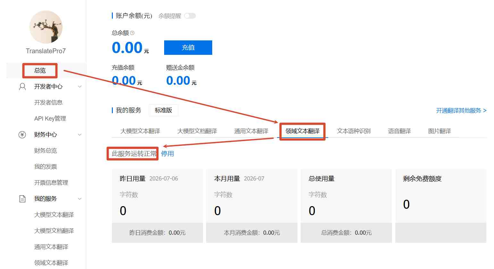
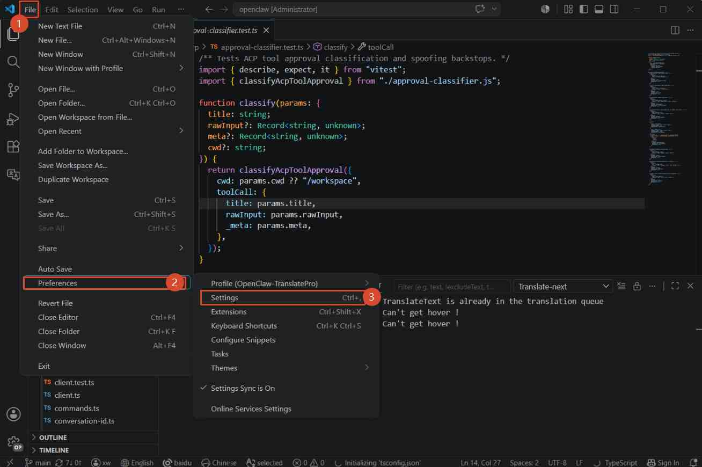
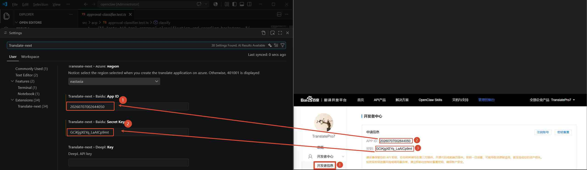
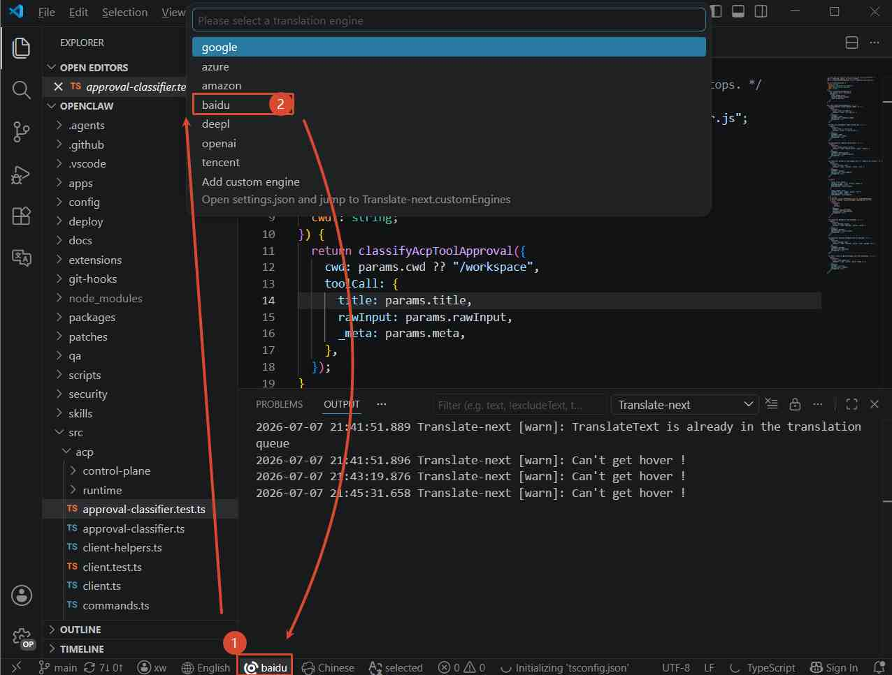

# 配置百度翻译Engine

## 第1步：注册百度翻译平台账号
官网地址： [https://fanyi-api.baidu.com/](https://fanyi-api.baidu.com/)

## 第2步：注册成为百度开发者
1. 进入管理控制台
	
2. 注册成为百度开发者
	

## 第3步：开通领域文本翻译
- 确认账号开通了领域文本翻译，如果没有开通请自行开通
	

## 第4步：打开vscode设置界面
1. 打开设置界面
	
2. 配置baidu：appId 和 Secret key
	

## 第5步：切换翻译Engine为baidu

至此配置已完成，可以正常使用了。

## 百度翻译相关，常见报错

 | 错误码 | 含义       | 解决方案                                               |
 | ------ | ---------- | ------------------------------------------------------ |
 | 52003  | 未授权用户 | 请检查appid是否正确或者服务是否开通                    |
 | 54003  | 访问受限   | 开通的服务可能是通用文本翻译服务，需要改成领域翻译服务 |
	
> 更多错误码，请查看 [错误码列表](https://api.fanyi.baidu.com/doc/22)

