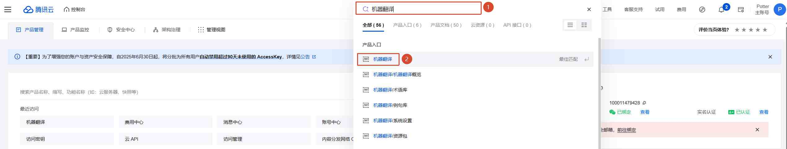
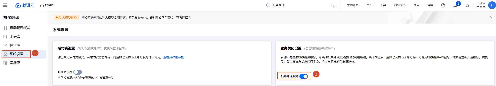
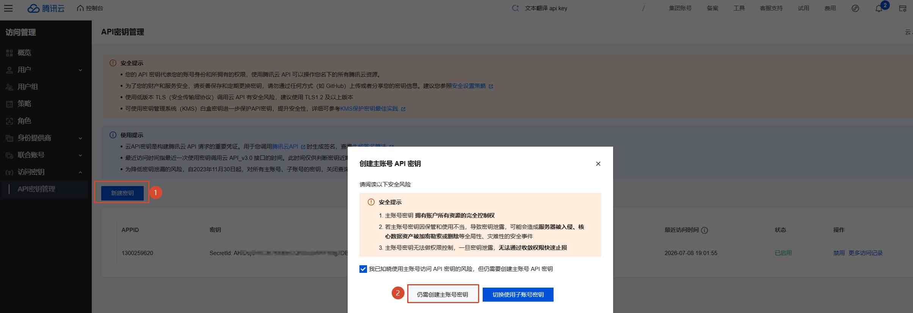
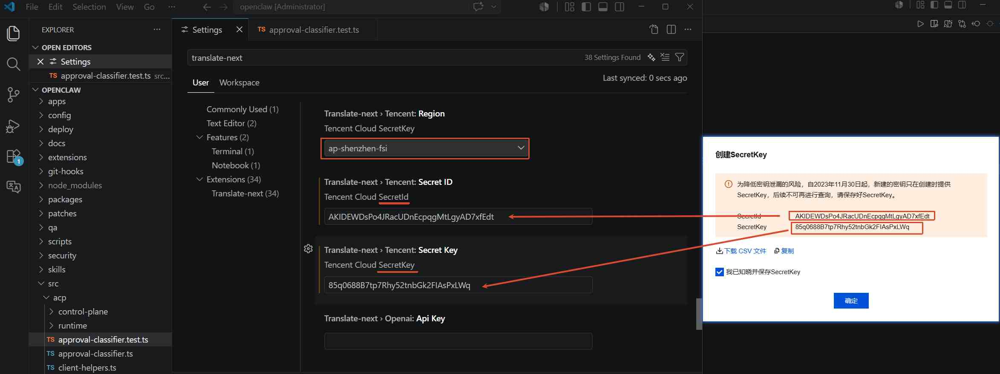

# 配置腾讯翻译Engine

## 第1步：注册腾讯云账号
官网地址：[https://console.cloud.tencent.com/](https://console.cloud.tencent.com/)

## 第2步：开通机器翻译

## 第3步：创建api key
快捷跳转链接: [https://console.cloud.tencent.com/cam/capi?__qcai_handover=nGANo4jE](https://console.cloud.tencent.com/cam/capi?__qcai_handover=nGANo4jE)

至此配置已完成，可以正常使用了。

